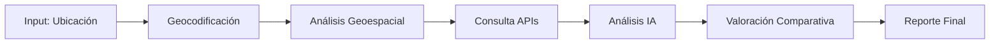

# Herramienta de Análisis de Terrenos

## Descripción General

Esta herramienta automatiza el análisis completo de terrenos para desarrollo inmobiliario, evaluando viabilidad, ubicación y valoración mediante IA y datos geoespaciales.

---

## Funcionalidades Principales

### 1. Análisis de Ubicación
- **Geolocalización precisa:** Coordenadas GPS y dirección exacta
- **Accesibilidad:** Distancia a vías principales, transporte público
- **Servicios cercanos:** Escuelas, hospitales, comercios, parques
- **Proyección de crecimiento urbano:** Análisis predictivo de expansión

### 2. Análisis de Viabilidad
- **Topografía:** Pendientes, elevación, drenaje natural
- **Características del suelo:** Tipo, capacidad de carga, permeabilidad
- **Restricciones ambientales:** Zonas protegidas, cuerpos de agua
- **Servicios disponibles:** Agua, electricidad, alcantarillado, gas

### 3. Valoración del Terreno
- **Comparables de mercado:** Precios de terrenos similares en la zona
- **Tendencias históricas:** Evolución de precios en los últimos 5-10 años
- **Proyecciones futuras:** Estimación de valorización
- **Análisis de sobreprecio:** Detectar si el precio está inflado

### 4. Análisis de Competencia
- **Desarrollos cercanos:** Proyectos en construcción o planificados
- **Saturación del mercado:** Oferta vs. demanda en el área
- **Diferenciadores potenciales:** Oportunidades únicas del terreno

---

## Inputs Requeridos

```yaml
ubicacion:
  - direccion: "Calle ejemplo 123"
  - coordenadas: {lat: 19.4326, lng: -99.1332}
  - area_m2: 1000

precio:
  - precio_solicitado: 5000000
  - moneda: "MXN"

preferencias:
  - tipo_desarrollo: ["residencial", "comercial", "mixto"]
  - presupuesto_max: 10000000
```

---

## Outputs Generados

### Reporte de Análisis
```json
{
  "ubicacion": {
    "puntuacion": 8.5,
    "accesibilidad": "Excelente",
    "servicios_cercanos": ["hospital_2km", "escuela_500m"],
    "proyeccion_crecimiento": "Alto"
  },
  "viabilidad": {
    "puntuacion": 7.8,
    "topografia": "Favorable",
    "servicios": ["agua", "electricidad", "alcantarillado"],
    "restricciones": ["ninguna"]
  },
  "valoracion": {
    "precio_mercado": 4800000,
    "precio_solicitado": 5000000,
    "sobreprecio_porcentaje": 4.2,
    "recomendacion": "Negociar a 4,900,000 MXN"
  },
  "recomendacion_final": "COMPRAR CON NEGOCIACIÓN"
}
```

---

## Stack Tecnológico

### APIs y Servicios
- **Google Maps API:** Geolocalización y servicios cercanos
- **Mapbox:** Visualización de mapas avanzada
- **USGS Earth Explorer:** Datos topográficos
- **OpenStreetMap:** Datos geoespaciales abiertos

### Backend
- **Python + FastAPI**
- **GeoPandas:** Análisis geoespacial
- **Scikit-learn:** Modelos de valoración

### Base de Datos
- **PostgreSQL + PostGIS:** Datos geoespaciales
- **Redis:** Cache de consultas frecuentes

---

## Flujo de Trabajo



---

## Casos de Uso

### Caso 1: Desarrollador Busca Terreno
**Escenario:** Un desarrollador quiere comprar un terreno en zona suburbana
- **Input:** Ubicación, presupuesto máximo, tipo de desarrollo
- **Output:** Análisis comparativo de 10 terrenos candidatos
- **Valor:** Ahorro de 2-3 semanas de investigación manual

### Caso 2: Propietario Valora su Terreno
**Escenario:** Un propietario quiere saber el valor real de su terreno
- **Input:** Dirección, área, características
- **Output:** Valoración de mercado y proyección a 5 años
- **Valor:** Precio justo para venta o desarrollo

---

## Mejoras Futuras

- [ ] Integración con drones para análisis topográfico 3D
- [ ] IA para detectar patrones de fraude en títulos de propiedad
- [ ] Análisis de impacto ambiental automatizado
- [ ] Visualización AR/VR del terreno

---

## Enlaces Relacionados

- [[../HERRAMIENTAS-8-AUTOMATIZACION|Índice de Herramientas]]
- [[../02-Costos-Construccion/COSTOS-PRESUPUESTO-MATERIALES|Siguiente: Costos de Construcción]]
- [[../../03-Recursos/APIs-Geoespaciales|Recursos: APIs Geoespaciales]]
