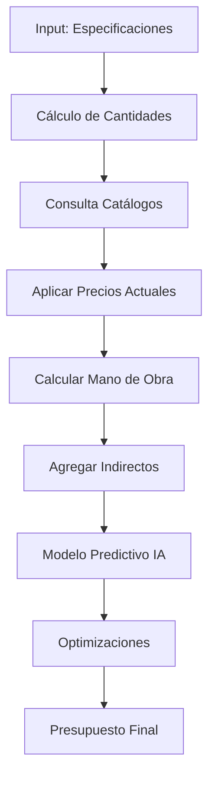

# Herramienta de Costos de Construcción

## Descripción General

Calculadora inteligente que estima costos de construcción en tiempo real, considerando materiales, mano de obra, equipos y fluctuaciones de mercado mediante IA predictiva.

---

## Funcionalidades Principales

### 1. Estimación de Materiales
- **Catálogo actualizado:** Base de datos de precios de materiales locales
- **Cantidades automáticas:** Cálculo basado en planos y especificaciones
- **Alternativas optimizadas:** Sugerencias de materiales equivalentes más económicos
- **Predicción de precios:** Proyección de costos futuros basada en tendencias

### 2. Cálculo de Mano de Obra
- **Tarifas por especialidad:** Albañiles, electricistas, plomeros, etc.
- **Rendimientos estándar:** Tiempos promedio por actividad
- **Factor de complejidad:** Ajustes por dificultad del proyecto
- **Disponibilidad regional:** Costos según ubicación geográfica

### 3. Equipos y Maquinaria
- **Renta vs. Compra:** Análisis de costo-beneficio
- **Cronograma de uso:** Optimización de tiempos de renta
- **Costos operativos:** Combustible, mantenimiento, operador

### 4. Costos Indirectos
- **Permisos y licencias:** Trámites municipales y estatales
- **Seguros:** Responsabilidad civil, todo riesgo
- **Imprevistos:** Reserva del 5-10% del presupuesto
- **Financiamiento:** Intereses y comisiones bancarias

---

## Inputs Requeridos

```yaml
proyecto:
  tipo: "residencial"  # residencial, comercial, industrial
  area_construccion_m2: 200
  niveles: 2
  acabados: "medio"  # economico, medio, premium
  ubicacion: "Ciudad de México"

especificaciones:
  estructura: "concreto_armado"  # concreto, acero, madera
  muros: "block"
  pisos: "ceramica"
  techos: "losa_concreto"
  instalaciones: ["electrica", "hidraulica", "gas", "clima"]

plazos:
  inicio: "2024-11-01"
  duracion_meses: 12
```

---

## Outputs Generados

### Presupuesto Desglosado

```json
{
  "resumen": {
    "costo_total": 4500000,
    "costo_por_m2": 22500,
    "moneda": "MXN",
    "confianza": "85%"
  },
  "desglose_por_capitulo": {
    "preliminares": {
      "costo": 180000,
      "porcentaje": 4
    },
    "cimentacion": {
      "costo": 450000,
      "porcentaje": 10
    },
    "estructura": {
      "costo": 900000,
      "porcentaje": 20
    },
    "albanileria": {
      "costo": 540000,
      "porcentaje": 12
    },
    "instalaciones": {
      "costo": 675000,
      "porcentaje": 15
    },
    "acabados": {
      "costo": 1125000,
      "porcentaje": 25
    },
    "equipamiento": {
      "costo": 270000,
      "porcentaje": 6
    },
    "indirectos": {
      "costo": 360000,
      "porcentaje": 8
    }
  },
  "variaciones_proyectadas": {
    "escenario_optimista": 4275000,
    "escenario_pesimista": 4950000,
    "principales_riesgos": [
      "Aumento de acero (15% probable)",
      "Escasez de cemento regional"
    ]
  },
  "optimizaciones_sugeridas": [
    {
      "concepto": "Cambiar block a panel prefabricado",
      "ahorro": 85000,
      "impacto_calidad": "Ninguno"
    },
    {
      "concepto": "Compra anticipada de acero",
      "ahorro": 120000,
      "condicion": "Si compra en próximos 30 días"
    }
  ]
}
```

---

## Stack Tecnológico

### Backend
- **Python + FastAPI**
- **Pandas:** Procesamiento de datos de costos
- **Prophet (Facebook):** Predicción de tendencias de precios
- **SQLAlchemy:** ORM para base de datos

### Base de Datos
- **PostgreSQL:** Catálogos de precios y proyectos
- **TimescaleDB:** Series temporales de precios históricos

### APIs y Fuentes de Datos
- **INEGI:** Índice Nacional de Precios Productor (INPP)
- **CMIC:** Cámara Mexicana de la Industria de la Construcción
- **Proveedores mayoristas:** APIs de Home Depot, Cemex, etc.
- **Bolsas de commodities:** Precios de acero, cobre, aluminio

### Machine Learning
- **Scikit-learn:** Modelos de regresión para estimación
- **XGBoost:** Predicción de costos complejos
- **LSTM Networks:** Proyección de precios de materiales

---

## Flujo de Trabajo



---

## Casos de Uso

### Caso 1: Constructor Pre-vende Desarrollos
**Escenario:** Constructor quiere fijar precios de venta antes de iniciar
- **Input:** Proyecto de 20 casas, acabados medios, 8 meses construcción
- **Output:** Presupuesto con proyecciones a 8 meses
- **Valor:** Margen de utilidad protegido contra inflación

### Caso 2: Arquitecto Presenta Propuesta
**Escenario:** Arquitecto necesita presupuesto preliminar para cliente
- **Input:** Bocetos básicos, área aproximada, nivel de acabados
- **Output:** Estimación rápida ±10% precisión
- **Valor:** Cierre de contrato en primera reunión

### Caso 3: Inversionista Evalúa Proyecto
**Escenario:** Inversionista compara 3 proyectos de desarrollo
- **Input:** Especificaciones de cada proyecto
- **Output:** Análisis comparativo de costos y optimizaciones
- **Valor:** Decisión informada, máximo ROI

---

## Módulos Especializados

### 1. Generador de Cuantificaciones
```python
# Pseudo-código
def calcular_cantidades(area_m2, niveles, tipo_estructura):
    # Basado en generadores automáticos de obra
    cuantificaciones = {
        'concreto_m3': area_m2 * niveles * 0.35,
        'acero_ton': area_m2 * niveles * 0.045,
        'block_pza': (perimetro * altura) / 0.09,
        # ... más cálculos
    }
    return cuantificaciones
```

### 2. Monitor de Precios en Tiempo Real
- Actualización diaria de catálogos
- Alertas de variaciones significativas (>5%)
- Histórico de precios para análisis

### 3. Simulador de Escenarios
- ¿Qué pasa si el acero sube 20%?
- ¿Cuánto ahorro con acabados económicos?
- ¿Conviene esperar 3 meses para construir?

---

## Integraciones

- **BIM (Revit, ArchiCAD):** Importar cantidades de obra
- **ERP construcción (Procore):** Exportar presupuestos
- **Bancos:** Consulta de tasas de financiamiento
- **SAT:** Precios vigentes para deducibilidad

---

## Mejoras Futuras

- [ ] IA que aprende de proyectos reales para ajustar estimaciones
- [ ] Integración con blockchain para trazabilidad de precios
- [ ] Marketplace de materiales con compra directa
- [ ] Calculadora de huella de carbono por material

---

## Enlaces Relacionados

- [[../01-Analisis-Terrenos/TERRENOS-ANALISIS-UBICACION-VIABILIDAD|Anterior: Análisis de Terrenos]]
- [[../03-Analisis-Mercado/MERCADO-DEMANDA-PRECIOS-ABSORCION|Siguiente: Análisis de Mercado]]
- [[../../03-Recursos/Catalogos-Precios|Recursos: Catálogos de Precios]]
