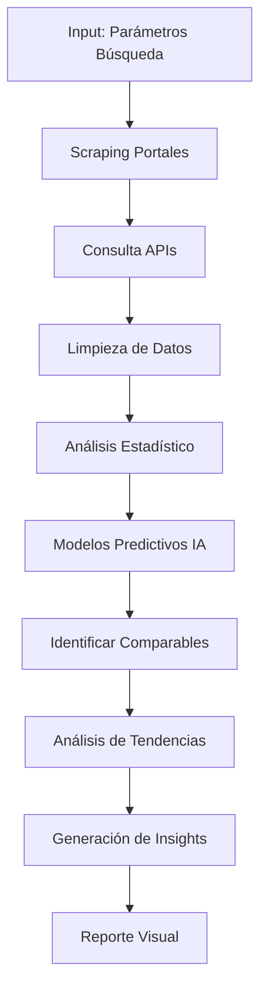

# Herramienta de Análisis de Mercado

## Descripción General

Sistema de inteligencia de mercado que analiza oferta, demanda, precios y tendencias del mercado inmobiliario mediante web scraping, APIs y modelos predictivos de IA.

---

## Funcionalidades Principales

### 1. Análisis de Demanda
- **Perfil del comprador:** Demografía, ingresos, preferencias
- **Absorción del mercado:** Velocidad de ventas en la zona
- **Estacionalidad:** Mejores épocas para lanzar proyecto
- **Intención de compra:** Análisis de búsquedas online y tráfico

### 2. Análisis de Oferta
- **Inventario disponible:** Unidades en venta/renta en la zona
- **Proyectos en construcción:** Pipeline de competencia
- **Características dominantes:** Tipos de unidades más comunes
- **Saturación:** Ratio oferta/demanda por zona

### 3. Análisis de Precios
- **Precios promedio m²:** Por zona, tipo de propiedad, acabados
- **Evolución histórica:** Tendencias de últimos 5-10 años
- **Proyección futura:** Predicción basada en IA
- **Comparables precisos:** Propiedades similares en radio definido

### 4. Tendencias del Mercado
- **Preferencias emergentes:** Smart homes, sustentabilidad, etc.
- **Cambios regulatorios:** Nuevas leyes que afectan mercado
- **Eventos económicos:** Tasas de interés, inflación, empleo
- **Desarrollos urbanos:** Nuevas vialidades, centros comerciales

---

## Inputs Requeridos

```yaml
ubicacion:
  zona: "Polanco, CDMX"
  radio_km: 3

tipo_propiedad:
  categoria: "departamento"  # casa, departamento, local, terreno
  caracteristicas:
    recamaras: 2
    banos: 2
    area_m2_min: 80
    area_m2_max: 120
    estacionamientos: 1

segmento:
  precio_rango: [3000000, 5000000]
  target: "clase media alta"
  uso: "residencial"  # residencial, inversion, vacacional

periodo_analisis:
  fecha_inicio: "2020-01-01"
  fecha_fin: "2024-10-21"
```

---

## Outputs Generados

### Reporte de Mercado

```json
{
  "resumen_ejecutivo": {
    "condiciones_mercado": "Mercado equilibrado",
    "puntuacion_atractivo": 7.8,
    "recomendacion": "PROCEDER CON OPTIMISMO"
  },

  "demanda": {
    "nivel": "Alto",
    "velocidad_absorcion_meses": 4.2,
    "perfil_comprador_principal": {
      "edad": "30-45 años",
      "ingreso_mensual": 45000,
      "composicion_familiar": "Jóvenes profesionistas o parejas jóvenes",
      "motivacion": "Primera vivienda o mejora"
    },
    "busquedas_online_tendencia": "+15% vs año anterior"
  },

  "oferta": {
    "inventario_actual_unidades": 342,
    "meses_inventario": 6.5,
    "proyectos_construccion": 8,
    "unidades_pipeline": 450,
    "nivel_saturacion": "Moderado"
  },

  "precios": {
    "precio_promedio_m2": 48500,
    "rango_precios_m2": {
      "minimo": 38000,
      "maximo": 65000,
      "percentil_25": 42000,
      "percentil_75": 55000
    },
    "evolucion_anual": {
      "2020": 42000,
      "2021": 44500,
      "2022": 46800,
      "2023": 47500,
      "2024": 48500
    },
    "proyeccion_2025": 51200,
    "crecimiento_anual_promedio": "3.8%"
  },

  "comparables": [
    {
      "direccion": "Calle Ejemplo 123",
      "area_m2": 95,
      "recamaras": 2,
      "precio_total": 4200000,
      "precio_m2": 44210,
      "dias_mercado": 45,
      "amenidades": ["gym", "roof garden", "seguridad 24/7"]
    }
    // ... más comparables
  ],

  "tendencias": {
    "preferencias_emergentes": [
      "Home office dedicado (+45% búsquedas)",
      "Balcón o terraza (+30%)",
      "Pet-friendly (+25%)"
    ],
    "amenidades_valoradas": [
      "Áreas verdes",
      "Gimnasio",
      "Co-working spaces",
      "Cargadores eléctricos"
    ],
    "factores_decisivos": [
      "Ubicación (95%)",
      "Precio (88%)",
      "Amenidades (75%)",
      "Acabados (68%)"
    ]
  },

  "oportunidades": [
    {
      "concepto": "Departamentos compactos (60-80m²)",
      "demanda_estimada": "Alta",
      "competencia": "Baja",
      "precio_sugerido_m2": 52000
    },
    {
      "concepto": "Studios con home office",
      "demanda_estimada": "Media-Alta",
      "competencia": "Media",
      "precio_sugerido_m2": 48000
    }
  ],

  "riesgos": [
    "8 proyectos en pipeline pueden saturar mercado en 18 meses",
    "Alza de tasas de interés puede reducir demanda en 10-15%",
    "Zona alcanzó pico de precios, posible corrección"
  ]
}
```

---

## Stack Tecnológico

### Web Scraping y Datos
- **Scrapy + BeautifulSoup:** Scraping de portales inmobiliarios
- **Selenium:** Scraping de sitios con JavaScript
- **APIs oficiales:** Zillow, Redfin, Inmuebles24, Propiedades.com

### Procesamiento y Análisis
- **Python + Pandas:** Limpieza y análisis de datos
- **NumPy:** Cálculos numéricos
- **Statsmodels:** Análisis estadístico

### Machine Learning
- **Scikit-learn:** Modelos de regresión y clasificación
- **Prophet:** Predicción de series temporales
- **NLP (spaCy):** Análisis de descripciones y reviews

### Visualización
- **Plotly:** Gráficas interactivas
- **Folium:** Mapas de calor de precios
- **Dash:** Dashboards interactivos

### Base de Datos
- **PostgreSQL:** Almacenamiento de datos históricos
- **Elasticsearch:** Búsqueda rápida de propiedades
- **Redis:** Cache de consultas

---

## Flujo de Trabajo



---

## Casos de Uso

### Caso 1: Desarrollador Busca Nicho
**Escenario:** Desarrollador quiere identificar segmento desatendido
- **Input:** Zona amplia, sin restricciones de tipo
- **Output:** Matriz de oportunidades por segmento
- **Valor:** Descubre nicho de "departamentos pet-friendly" con alta demanda y baja oferta

### Caso 2: Broker Valúa Propiedad
**Escenario:** Broker necesita precio competitivo para listado
- **Input:** Características exactas de la propiedad
- **Output:** Precio sugerido basado en comparables + tendencias
- **Valor:** Listado al precio óptimo, venta en 30 días

### Caso 3: Inversionista Evalúa Zona
**Escenario:** Inversionista compara 3 zonas para invertir
- **Input:** 3 ubicaciones, horizonte 5 años
- **Output:** Análisis comparativo con proyecciones
- **Valor:** Selecciona zona con mayor potencial de valorización

---

## Módulos Especializados

### 1. Scraper Inteligente
```python
# Pseudo-código
class InmuebleScraper:
    def __init__(self, fuentes):
        self.portales = ['inmuebles24', 'propiedades', 'vivanuncios']

    def scrape_all(self, parametros):
        resultados = []
        for portal in self.portales:
            data = self.scrape_portal(portal, parametros)
            resultados.extend(data)

        # Deduplicación inteligente
        resultados_unicos = self.deduplicar(resultados)
        return resultados_unicos

    def deduplicar(self, propiedades):
        # IA detecta duplicados aunque tengan diferentes fotos/descripciones
        # Basado en: ubicación, área, precio, características
        pass
```

### 2. Predictor de Precios
- Modelo entrenado con 10+ años de datos históricos
- Considera: ubicación, características, condiciones macro
- Actualización mensual con nuevos datos

### 3. Detector de Tendencias
- Análisis de búsquedas en Google Trends
- Monitoreo de redes sociales (Twitter, Instagram)
- Análisis de contenido de blogs/vlogs inmobiliarios

---

## Fuentes de Datos

### Portales Inmobiliarios
- Inmuebles24, Propiedades.com, Vivanuncios
- Zillow, Redfin (USA)
- Idealista, Fotocasa (España)

### Datos Gubernamentales
- INEGI: Censos, estadísticas económicas
- Registros públicos de propiedad
- Datos de permisos de construcción

### Datos Financieros
- Banxico: Tasas de interés
- Índices de inflación
- Indicadores de empleo

### Otras Fuentes
- Google Maps: POIs, tráfico
- Redes sociales: Sentimiento y tendencias
- Medios especializados: Noticias del sector

---

## Integraciones

- **CRM Inmobiliario:** Exportar leads y análisis
- **Herramientas de Marketing:** Segmentación de audiencias
- **Plataformas de Listado:** Publicación automática
- **Sistemas de Valuación:** Integración con avalúos certificados

---

## Mejoras Futuras

- [ ] IA conversacional para consultas en lenguaje natural
- [ ] Integración con imágenes satelitales para detectar construcciones
- [ ] Análisis de sentimiento en reviews de desarrollos
- [ ] Predicción de gentrificación de zonas
- [ ] Análisis de riesgo climático (inundaciones, etc.)

---

## KPIs del Sistema

- **Precisión de predicciones:** ±5% en precios proyectados
- **Actualización de datos:** Diaria para precios, semanal para inventario
- **Cobertura:** 95% de zonas urbanas principales
- **Velocidad:** Reporte completo en <2 minutos

---

## Enlaces Relacionados

- [[../02-Costos-Construccion/COSTOS-PRESUPUESTO-MATERIALES|Anterior: Costos de Construcción]]
- [[../04-Proyecciones-Financieras/FINANCIERO-FLUJO-CAJA-PROFORMA|Siguiente: Proyecciones Financieras]]
- [[../../03-Recursos/Fuentes-Datos-Mercado|Recursos: Fuentes de Datos]]
