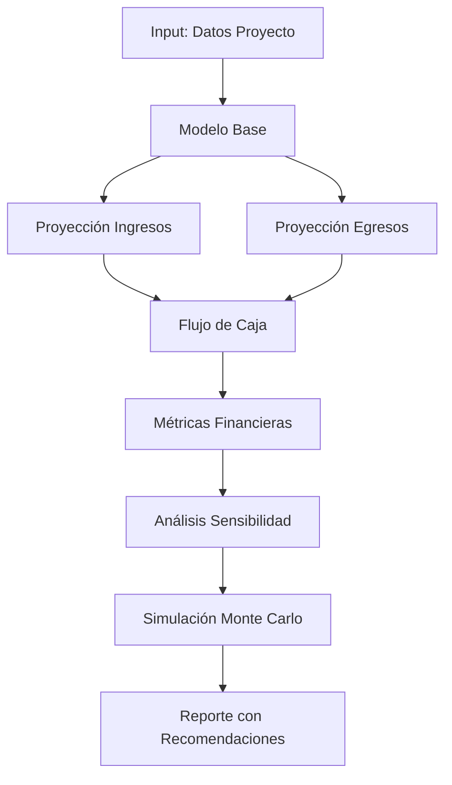

# Herramienta de Proyecciones Financieras

## Descripción General

Modelo financiero dinámico que proyecta ingresos, gastos, flujo de caja y rentabilidad del proyecto inmobiliario, integrando datos reales y escenarios probabilísticos mediante IA.

---

## Funcionalidades Principales

### 1. Proyección de Ingresos
- **Ventas pre-construcción:** Estimación por fase de avance
- **Ventas post-entrega:** Ritmo de comercialización
- **Rentas (si aplica):** Ingresos por arrendamiento
- **Escalamiento de precios:** Ajustes por fase y mercado

### 2. Proyección de Egresos
- **Costos de construcción:** Por fase y cronograma
- **Costos financieros:** Intereses de créditos
- **Gastos operativos:** Comercialización, administración
- **Impuestos y comisiones:** ISR, IVA, comisiones broker

### 3. Flujo de Caja
- **Flujo mensual/trimestral:** Entradas vs. salidas
- **Saldo acumulado:** Posición de efectivo
- **Necesidades de financiamiento:** Momentos críticos de liquidez
- **Punto de equilibrio:** Cuándo el proyecto se autofinancia

### 4. Análisis de Sensibilidad
- **Escenarios múltiples:** Optimista, base, pesimista
- **Variables críticas:** Precio, velocidad venta, costos
- **Simulación Monte Carlo:** 1000+ escenarios aleatorios
- **Análisis de tornado:** Variables con mayor impacto

---

## Inputs Requeridos

```yaml
proyecto:
  nombre: "Residencial Los Pinos"
  tipo: "departamentos"
  unidades: 24
  precio_promedio_unidad: 3500000

cronograma:
  inicio_construccion: "2024-11-01"
  duracion_meses: 18
  inicio_ventas: "2024-12-01"  # Preventa
  entrega: "2025-05-01"

costos:
  terreno: 8000000
  construccion_total: 60000000
  proyecto_arquitectonico: 1200000
  permisos_licencias: 800000
  comercializacion: 2400000  # 4% de ventas
  administracion_mensual: 150000

financiamiento:
  credito_construccion:
    monto: 40000000
    tasa_anual: 12.5
    comision_apertura: 1.5
  capital_propio: 30000000

ventas:
  preventa_objetivo: 60  # % unidades en preventa
  ritmo_ventas_mensual: 3  # unidades/mes
  descuento_preventa: 10  # % descuento
  comision_broker: 3  # %
```

---

## Outputs Generados

### Modelo Financiero Completo

```json
{
  "resumen_ejecutivo": {
    "inversion_total": 70000000,
    "ingresos_totales": 84000000,
    "utilidad_neta": 14000000,
    "margen_utilidad": 16.67,
    "roi": 20.0,
    "payback_meses": 14,
    "tir_mensual": 1.45,
    "tir_anual": 18.95
  },

  "ingresos_proyectados": {
    "ventas_preventa": {
      "unidades": 14,
      "ingreso": 44100000,
      "descuento_aplicado": 4900000
    },
    "ventas_construccion": {
      "unidades": 8,
      "ingreso": 28000000
    },
    "ventas_post_entrega": {
      "unidades": 2,
      "ingreso": 7000000
    },
    "total_ventas": 84000000
  },

  "egresos_proyectados": {
    "terreno": 8000000,
    "construccion": 60000000,
    "proyecto_diseno": 1200000,
    "permisos": 800000,
    "comercializacion": 2520000,  # 3% comisión
    "administracion": 2700000,  # 18 meses
    "financieros_intereses": 3780000,
    "impuestos_isr": 2500000,
    "total_egresos": 81500000
  },

  "flujo_caja_mensual": [
    {
      "mes": 1,
      "fecha": "2024-11-01",
      "ingresos": 9800000,  # Preventa inicial
      "egresos": 8150000,  # Terreno + inicio construcción
      "flujo_neto": 1650000,
      "saldo_acumulado": 1650000
    },
    {
      "mes": 2,
      "fecha": "2024-12-01",
      "ingresos": 10500000,
      "egresos": 3450000,
      "flujo_neto": 7050000,
      "saldo_acumulado": 8700000
    }
    // ... 18 meses más
  ],

  "punto_equilibrio": {
    "mes": 11,
    "unidades_vendidas": 18,
    "porcentaje_proyecto": 75
  },

  "necesidades_capital": {
    "momento_critico": {
      "mes": 6,
      "deficit_maximo": -2300000,
      "solucion": "Liberación crédito puente o acelerar preventa"
    },
    "capital_trabajo_requerido": 5000000
  },

  "analisis_sensibilidad": {
    "escenario_base": {
      "utilidad": 14000000,
      "roi": 20.0,
      "probabilidad": "50%"
    },
    "escenario_optimista": {
      "utilidad": 19500000,
      "roi": 27.86,
      "supuestos": ["Preventa 80%", "Costos -5%", "Precios +8%"],
      "probabilidad": "25%"
    },
    "escenario_pesimista": {
      "utilidad": 7200000,
      "roi": 10.29,
      "supuestos": ["Preventa 40%", "Costos +10%", "Precios -5%"],
      "probabilidad": "25%"
    }
  },

  "variables_criticas": {
    "impacto_en_utilidad": {
      "velocidad_ventas": "Alto (85%)",
      "precio_venta": "Alto (80%)",
      "costo_construccion": "Medio (60%)",
      "tasa_interes": "Bajo (25%)"
    }
  },

  "simulacion_monte_carlo": {
    "escenarios_analizados": 10000,
    "utilidad_promedio": 13200000,
    "utilidad_mediana": 13800000,
    "probabilidad_utilidad_positiva": 94.5,
    "var_95": 4500000,  # En el 95% de casos, utilidad > 4.5M
    "desviacion_estandar": 3200000
  }
}
```

---

## Stack Tecnológico

### Backend
- **Python + FastAPI**
- **NumPy:** Cálculos matemáticos
- **Pandas:** Manipulación de datos financieros
- **QuantLib:** Modelado financiero avanzado

### Machine Learning
- **Scikit-learn:** Modelos predictivos
- **TensorFlow:** Redes neuronales para proyecciones
- **PyMC3:** Inferencia bayesiana

### Simulación
- **NumPy.random:** Simulación Monte Carlo
- **SciPy.stats:** Distribuciones probabilísticas
- **SimPy:** Simulación de eventos discretos

### Visualización
- **Plotly:** Gráficas interactivas
- **Matplotlib/Seaborn:** Visualización estática
- **Dash:** Dashboard financiero en tiempo real

---

## Flujo de Trabajo



---

## Casos de Uso

### Caso 1: Desarrollador Busca Financiamiento
**Escenario:** Presentar proyecto a banco o inversionistas
- **Input:** Proyecto completo con todas las variables
- **Output:** Modelo financiero profesional + pitch deck
- **Valor:** Aprobación de crédito con mejores condiciones

### Caso 2: Ajustar Estrategia Comercial
**Escenario:** Ventas lentas a mitad de proyecto
- **Input:** Actualizar modelo con datos reales
- **Output:** Simulaciones de escenarios (bajar precio, promociones, etc.)
- **Valor:** Decisión óptima para recuperar flujo

### Caso 3: Evaluar Viabilidad de Proyecto
**Escenario:** Decidir si proceder con inversión
- **Input:** Datos preliminares de terreno, costos, mercado
- **Output:** Proyección con rangos de rentabilidad
- **Valor:** Go/No-go decision informada

---

## Módulos Especializados

### 1. Motor de Cronograma Financiero
```python
# Pseudo-código
class CronogramaFinanciero:
    def __init__(self, duracion_meses, inicio):
        self.meses = duracion_meses
        self.fecha_inicio = inicio

    def proyectar_ingresos(self, ritmo_ventas, precio_promedio):
        ingresos_mensuales = []
        for mes in range(self.meses):
            # Considerar estacionalidad de ventas
            factor_estacional = self.calcular_estacionalidad(mes)
            unidades_vendidas = ritmo_ventas * factor_estacional
            ingreso = unidades_vendidas * precio_promedio
            ingresos_mensuales.append(ingreso)
        return ingresos_mensuales

    def proyectar_egresos(self, curva_construccion):
        # Basado en curva S típica de construcción
        pass
```

### 2. Simulador Monte Carlo
- 10,000 iteraciones por proyecto
- Variables aleatorias: precios, costos, tiempos, tasas
- Distribuciones: Normal, Triangular, Uniforme según variable
- Output: Distribución de probabilidad de utilidad/ROI

### 3. Optimizador de Estrategia
- IA que sugiere mejores momentos para:
  - Lanzar preventa
  - Ajustar precios
  - Solicitar financiamiento
  - Iniciar entregas

---

## Métricas Clave (KPIs)

### Rentabilidad
- **ROI (Return on Investment):** % retorno sobre inversión
- **TIR (Tasa Interna de Retorno):** % anual efectivo
- **VAN (Valor Actual Neto):** Valor presente de flujos futuros
- **Margen de Utilidad:** % utilidad / ingresos

### Liquidez
- **Flujo de Caja Operativo:** Efectivo generado/consumido
- **Punto de Equilibrio:** Momento de cero flujo negativo
- **Capital de Trabajo:** Efectivo necesario para operar

### Riesgo
- **VaR (Value at Risk):** Pérdida máxima en X% escenarios
- **Sensibilidad:** Impacto de cambio en variables
- **Ratio de Cobertura:** Ingresos / Servicio de deuda

---

## Integraciones

- **Herramienta de Costos:** Import automático de presupuesto
- **Análisis de Mercado:** Precios y velocidad de venta
- **Bancos:** Consulta de tasas y condiciones crédito
- **ERP/Contabilidad:** Sincronización de datos reales

---

## Reportes Generados

### 1. Executive Summary (1 página)
- Resumen de inversión, ingresos, utilidad, ROI
- Gráfica de flujo de caja acumulado
- Semáforo de viabilidad

### 2. Modelo Detallado (Excel/PDF)
- Tablas mensuales completas
- Desglose por concepto
- Supuestos y notas

### 3. Análisis de Escenarios
- Comparativo base vs optimista vs pesimista
- Recomendaciones estratégicas
- Plan de contingencia

### 4. Pitch Deck Inversionistas
- Presentación visual
- Highlights financieros
- Simulación de retornos

---

## Mejoras Futuras

- [ ] Integración con blockchain para tokenización de proyecto
- [ ] IA que aprende de desviaciones reales vs proyectadas
- [ ] Comparación automática vs proyectos similares
- [ ] Alertas en tiempo real de desviaciones críticas
- [ ] Optimización automática de estructura de capital

---

## Plantillas y Recursos

- [[Templates/Modelo-Financiero-Base.xlsx|Plantilla Excel]]
- [[Templates/Pitch-Deck-Inversionistas.pptx|Pitch Deck]]
- [[Recursos/Tasas-Financiamiento|Tasas Actualizadas]]

---

## Enlaces Relacionados

- [[../03-Analisis-Mercado/MERCADO-DEMANDA-PRECIOS-ABSORCION|Anterior: Análisis de Mercado]]
- [[../05-Analisis-Zonificacion/ZONIFICACION-REGULACIONES-PERMISOS|Siguiente: Análisis de Zonificación]]
- [[../06-Calculo-ROI/ROI-RENTABILIDAD-METRICAS-FINANCIERAS|Cálculo de ROI]]
