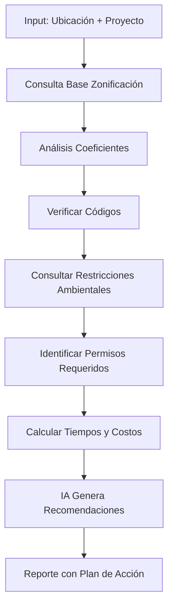

# Herramienta de Análisis de Zonificación

## Descripción General

Sistema automatizado que verifica compatibilidad del proyecto con regulaciones de zonificación, códigos de construcción, restricciones ambientales y requisitos de permisos mediante consulta de bases de datos oficiales y análisis de IA.

---

## Funcionalidades Principales

### 1. Verificación de Zonificación
- **Uso de suelo permitido:** Residencial, comercial, mixto, industrial
- **Densidad máxima:** Viviendas/hectárea, habitantes/m²
- **Coeficientes de ocupación:** COS (Coeficiente de Ocupación del Suelo)
- **Coeficientes de utilización:** CUS (Coeficiente de Utilización del Suelo)
- **Restricciones de altura:** Niveles máximos permitidos
- **Áreas libres obligatorias:** Jardines, estacionamientos

### 2. Códigos de Construcción
- **Normas estructurales:** Sismorresistencia, cargas, cimentación
- **Normas de seguridad:** Salidas de emergencia, extintores, señalética
- **Normas de accesibilidad:** Rampas, elevadores, baños adaptados
- **Instalaciones:** Eléctricas, hidráulicas, gas, telecomunicaciones
- **Eficiencia energética:** Aislamiento, iluminación, ventilación

### 3. Restricciones Ambientales
- **Áreas protegidas:** Parques nacionales, reservas ecológicas
- **Cuerpos de agua:** Zonas federales, restricciones ribereñas
- **Zonas de riesgo:** Fallas geológicas, inundaciones, deslaves
- **Impacto ambiental:** Estudios requeridos (MIA, DIA)
- **Manejo de residuos:** Separación, disposición, reciclaje

### 4. Permisos y Trámites
- **Licencias de construcción:** Requisitos y tiempos de gestión
- **Permisos especiales:** Demolición, excavación, uso de vía pública
- **Certificaciones:** Protección Civil, uso de suelo, terminación de obra
- **Dictámenes técnicos:** Estructural, instalaciones, seguridad
- **Costos de trámites:** Derechos, asesorías, gestorías

---

## Inputs Requeridos

```yaml
ubicacion:
  direccion: "Av. Reforma 222, Cuauhtémoc, CDMX"
  coordenadas: {lat: 19.4326, lng: -99.1332}
  superficie_terreno_m2: 1200

proyecto:
  uso: "residencial_multifamiliar"
  unidades: 16
  niveles: 5
  area_construccion_m2: 2400
  estacionamientos: 20
  area_verde_m2: 180

construccion:
  tipo_estructura: "concreto_armado"
  altura_metros: 18
  uso_mixto: false
  demolicion_previa: true
```

---

## Outputs Generados

### Reporte de Viabilidad Regulatoria

```json
{
  "resumen_ejecutivo": {
    "viabilidad": "VIABLE CON CONDICIONES",
    "puntuacion_cumplimiento": 8.2,
    "tiempo_estimado_permisos": "4-6 meses",
    "costo_estimado_tramites": 185000,
    "alertas_criticas": 2
  },

  "zonificacion": {
    "clasificacion_zona": "H5/40/M",
    "uso_suelo_permitido": ["habitacional", "comercio menor"],
    "densidad": {
      "permitida_viv_ha": 200,
      "proyecto_viv_ha": 133,
      "cumple": true
    },
    "coeficientes": {
      "COS_maximo": 0.60,
      "COS_proyecto": 0.50,
      "cumple": true,
      "CUS_maximo": 2.4,
      "CUS_proyecto": 2.0,
      "cumple": true
    },
    "altura": {
      "maxima_metros": 25,
      "maxima_niveles": 7,
      "proyecto_metros": 18,
      "proyecto_niveles": 5,
      "cumple": true
    },
    "restricciones": [
      {
        "tipo": "area_libre",
        "requerimiento": "30% del terreno",
        "proyecto": "35%",
        "cumple": true
      },
      {
        "tipo": "estacionamientos",
        "requerimiento": "1.25 cajones/vivienda",
        "proyecto": "1.25 cajones/vivienda",
        "cumple": true
      }
    ]
  },

  "codigos_construccion": {
    "estructural": {
      "zona_sismica": "B",
      "norma_aplicable": "NTC-DS-2017",
      "requerimientos": [
        "Estudio de mecánica de suelos",
        "Diseño sismorresistente",
        "DRO por corresponsable estructural"
      ]
    },
    "seguridad": {
      "salidas_emergencia_requeridas": 2,
      "ancho_minimo_escaleras": 1.2,
      "sistema_deteccion_incendios": true,
      "extintores_requeridos": 8
    },
    "accesibilidad": {
      "rampa_acceso": true,
      "elevador": true,
      "banos_adaptados": 2,
      "cajones_discapacidad": 1
    },
    "eficiencia_energetica": {
      "aislamiento_termico": "Requerido en muros",
      "iluminacion_led": "100% áreas comunes",
      "calentadores_solares": "Recomendado"
    }
  },

  "restricciones_ambientales": {
    "areas_protegidas": {
      "dentro": false,
      "cercanas": ["Bosque de Chapultepec - 2.3 km"]
    },
    "cuerpos_agua": {
      "cercanos": "Ninguno en 500m",
      "restricciones": "N/A"
    },
    "zonas_riesgo": {
      "inundacion": "Riesgo bajo",
      "sismos": "Zona B - riesgo medio",
      "deslaves": "No aplica"
    },
    "estudios_requeridos": [
      {
        "tipo": "Estudio de Impacto Urbano",
        "obligatorio": true,
        "costo_estimado": 45000,
        "tiempo_elaboracion": "2-3 semanas"
      }
    ],
    "manejo_residuos": {
      "plan_requerido": true,
      "separacion_obligatoria": ["organicos", "inorganicos", "reciclables"]
    }
  },

  "permisos_tramites": [
    {
      "tramite": "Certificado Único de Zonificación de Uso de Suelo",
      "dependencia": "SEDUVI",
      "costo": 2500,
      "tiempo_dias": 10,
      "requisitos": [
        "Solicitud en línea",
        "Boleta predial",
        "Identificación oficial"
      ],
      "status": "PENDIENTE",
      "urgencia": "Alta"
    },
    {
      "tramite": "Licencia de Construcción Tipo B",
      "dependencia": "SEDUVI",
      "costo": 85000,
      "tiempo_dias": 60,
      "requisitos": [
        "Proyecto arquitectónico",
        "Memoria de cálculo estructural",
        "Proyecto de instalaciones",
        "DRO estructural y instalaciones",
        "Pago de derechos",
        "Alineamiento y número oficial",
        "Estudio de mecánica de suelos"
      ],
      "status": "PENDIENTE",
      "urgencia": "Alta"
    },
    {
      "tramite": "Visto Bueno de Protección Civil",
      "dependencia": "Secretaría de Protección Civil",
      "costo": 12000,
      "tiempo_dias": 20,
      "requisitos": [
        "Programa interno de protección civil",
        "Planos de seguridad",
        "Constancia de capacitación"
      ],
      "status": "PENDIENTE",
      "urgencia": "Media"
    }
    // ... más trámites
  ],

  "alertas": [
    {
      "nivel": "CRITICO",
      "titulo": "Demolición previa requiere permiso especial",
      "descripcion": "Se detectó que el proyecto contempla demolición. Se debe tramitar permiso de demolición antes de licencia de construcción.",
      "impacto": "+30 días al cronograma",
      "solucion": "Iniciar trámite de demolición inmediatamente"
    },
    {
      "nivel": "ADVERTENCIA",
      "titulo": "Zona sísmica B - requerimientos estructurales estrictos",
      "descripcion": "El proyecto está en zona sísmica B, requiere DRO estructural y diseño sismorresistente riguroso.",
      "impacto": "+$250,000 en costos de ingeniería",
      "solucion": "Contratar ingeniero estructurista certificado"
    }
  ],

  "recomendaciones": [
    "Iniciar trámites de permisos en paralelo a desarrollo de proyecto ejecutivo",
    "Contratar gestor especializado para reducir tiempo de permisos en 30%",
    "Considerar certificación LEED para beneficios fiscales (10% descuento en predial)",
    "Aprovechar programa de densificación habitacional para bonos de altura"
  ],

  "cronograma_permisos": {
    "duracion_total_meses": 5.5,
    "ruta_critica": [
      "Certificado de uso de suelo → 10 días",
      "Proyecto ejecutivo → 45 días (paralelo)",
      "Licencia de construcción → 60 días",
      "Permisos complementarios → 30 días (paralelo)"
    ]
  }
}
```

---

## Stack Tecnológico

### Backend
- **Python + FastAPI**
- **GeoPandas:** Análisis geoespacial de zonificación
- **PyPDF2:** Extracción de datos de PDFs de regulaciones
- **Requests:** Consulta de APIs gubernamentales

### NLP y IA
- **spaCy:** Procesamiento de textos legales
- **BERT/GPT:** Interpretación de normativas ambiguas
- **Document AI:** Extracción de requisitos de documentos

### Base de Datos
- **PostgreSQL + PostGIS:** Mapas de zonificación
- **MongoDB:** Normativas y regulaciones
- **Neo4j:** Relaciones entre permisos y requisitos

### APIs y Fuentes
- **Gobierno Federal/Estatal/Municipal:** Datos oficiales
- **Registros catastrales:** Límites de predios
- **INEGI:** Áreas de riesgo, protegidas
- **Google Civic Information API:** Distritos y jurisdicciones

---

## Flujo de Trabajo



---

## Casos de Uso

### Caso 1: Pre-evaluación de Terreno
**Escenario:** Desarrollador evalúa si terreno es viable antes de comprar
- **Input:** Ubicación + tipo de proyecto contemplado
- **Output:** Viabilidad regulatoria + alertas tempranas
- **Valor:** Evita compra de terreno no viable, ahorro de millones

### Caso 2: Planificación de Cronograma
**Escenario:** Constructor necesita cronograma realista incluyendo permisos
- **Input:** Proyecto definido
- **Output:** Lista de trámites con tiempos y secuencia
- **Valor:** Cronograma preciso, evita retrasos

### Caso 3: Optimización de Proyecto
**Escenario:** Arquitecto ajusta diseño para maximizar aprovechamiento legal
- **Input:** Terreno + restricciones deseadas (altura, densidad)
- **Output:** Parámetros máximos permitidos + sugerencias
- **Valor:** Diseño óptimo desde perspectiva regulatoria

---

## Módulos Especializados

### 1. Intérprete de Normativas
```python
# Pseudo-código
class InterpretadorNormativas:
    def __init__(self):
        self.modelo_nlp = cargar_modelo("bert-normativas-mx")

    def extraer_requisitos(self, texto_legal):
        # Extrae requisitos estructurados de texto legal
        doc = self.modelo_nlp(texto_legal)
        requisitos = []

        for entidad in doc.ents:
            if entidad.label_ == "REQUISITO":
                requisitos.append({
                    'texto': entidad.text,
                    'categoria': clasificar(entidad),
                    'obligatorio': detectar_obligatoriedad(entidad)
                })

        return requisitos
```

### 2. Calculadora de Coeficientes
- Interpreta tablas de zonificación
- Calcula COS, CUS, densidades
- Compara proyecto vs permitido
- Sugiere ajustes para cumplimiento

### 3. Generador de Cronograma de Trámites
- Identifica dependencias entre permisos
- Optimiza secuencia (ruta crítica)
- Considera tiempos variables por dependencia
- Sugiere trámites en paralelo

---

## Cobertura Geográfica

### México
- **Federal:** SEMARNAT, CONAGUA, INAH
- **CDMX:** SEDUVI, Alcaldías (16)
- **Estado de México:** Municipios principales
- **Jalisco:** Guadalajara, ZM
- **Nuevo León:** Monterrey, ZM

### Expansión Futura
- 50 ciudades principales de México
- América Latina (Colombia, Chile, Perú)
- España (Madrid, Barcelona)

---

## Integraciones

- **Herramienta de Terrenos:** Validación automática post-análisis
- **Herramienta de Costos:** Agregar costos de permisos
- **Cronograma de Proyecto:** Incorporar tiempos de trámites
- **Sistemas Gobierno:** Consulta automática de estatus de trámites

---

## Actualizaciones

- **Normativas:** Revisión mensual de cambios regulatorios
- **Costos de trámites:** Actualización anual
- **Tiempos de respuesta:** Calibración trimestral basada en datos reales
- **Nuevas regulaciones:** Alertas en tiempo real

---

## Mejoras Futuras

- [ ] OCR avanzado para escanear planos catastrales
- [ ] Chatbot que responde dudas sobre normativas
- [ ] Integración con despachos de gestores
- [ ] Predicción de probabilidad de aprobación de permisos
- [ ] Generación automática de documentos para trámites

---

## KPIs del Sistema

- **Precisión de requisitos:** 95% de requisitos identificados
- **Tiempo de análisis:** <3 minutos por proyecto
- **Cobertura normativa:** 90% de regulaciones vigentes
- **Actualización:** 100% de cambios incorporados en <30 días

---

## Enlaces Relacionados

- [[../04-Proyecciones-Financieras/FINANCIERO-FLUJO-CAJA-PROFORMA|Anterior: Proyecciones Financieras]]
- [[../06-Calculo-ROI/ROI-RENTABILIDAD-METRICAS-FINANCIERAS|Siguiente: Cálculo de ROI]]
- [[../../03-Recursos/Normativas-Construccion|Recursos: Normativas]]
