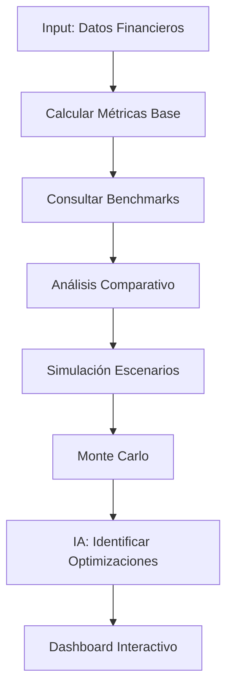

# Herramienta de Cálculo de ROI

## Descripción General

Calculadora avanzada de métricas de rentabilidad inmobiliaria (ROI, TIR, VAN, CAP Rate, etc.) con análisis comparativo, benchmarking contra mercado y recomendaciones de optimización mediante IA.

---

## Funcionalidades Principales

### 1. Métricas de Rentabilidad
- **ROI (Return on Investment):** Retorno sobre inversión
- **TIR (Tasa Interna de Retorno):** Rentabilidad anualizada
- **VAN (Valor Actual Neto):** Valor presente de flujos futuros
- **CAP Rate:** Tasa de capitalización para rentas
- **Cash-on-Cash Return:** Retorno sobre efectivo invertido
- **Payback Period:** Tiempo de recuperación de inversión

### 2. Análisis Comparativo
- **Benchmark vs mercado:** Comparar con proyectos similares
- **Ranking de métricas:** Posicionamiento del proyecto
- **Oportunidades de mejora:** Dónde optimizar para mejor ROI
- **Análisis de pares:** Competencia y estándares del sector

### 3. Análisis por Escenarios
- **Base, optimista, pesimista:** Sensibilidad de rentabilidad
- **Variables de impacto:** Qué afecta más el ROI
- **Puntos de inflexión:** Umbrales críticos
- **Simulación probabilística:** Distribución de resultados

### 4. Optimización de Rentabilidad
- **Sugerencias IA:** Cómo mejorar métricas
- **Trade-offs:** Análisis costo-beneficio de cambios
- **Estrategias de salida:** Venta, renta, desarrollo por fases
- **Estructura financiera óptima:** Deuda vs capital propio

---

## Inputs Requeridos

```yaml
inversion:
  terreno: 8000000
  construccion: 60000000
  otros: 4000000
  inversion_total: 72000000
  capital_propio: 30000000
  financiamiento: 42000000

ingresos:
  ventas_totales: 96000000
  rentas_mensuales: 0  # Si aplica
  otros_ingresos: 0

egresos:
  costos_totales: 64000000
  gastos_operativos: 2400000
  intereses: 3600000
  impuestos: 4200000
  egresos_totales: 74200000

cronograma:
  duracion_proyecto_meses: 18
  horizonte_evaluacion_anos: 5

proyecto:
  tipo: "residencial"
  estrategia: "venta"  # venta, renta, mixto
  ubicacion: "Polanco, CDMX"
```

---

## Outputs Generados

### Dashboard de Rentabilidad

```json
{
  "resumen_ejecutivo": {
    "proyecto_viable": true,
    "nivel_atractivo": "MUY ATRACTIVO",
    "puntuacion_general": 8.7,
    "recomendacion": "PROCEDER - ROI superior a promedio del mercado"
  },

  "metricas_principales": {
    "roi": {
      "valor": 30.28,
      "unidad": "%",
      "interpretacion": "Por cada peso invertido, se recupera 1.30 pesos",
      "benchmark_mercado": 22.5,
      "ranking": "Top 15% del mercado"
    },
    "tir": {
      "mensual": 1.82,
      "anual": 24.15,
      "unidad": "%",
      "interpretacion": "Rentabilidad anualizada de 24.15%",
      "benchmark_mercado": 18.5,
      "superior_a": ["Cetes (10.5%)", "Fibras (12.8%)", "Promedio sector (18.5%)"]
    },
    "van": {
      "valor": 18600000,
      "unidad": "MXN",
      "tasa_descuento": 12,
      "interpretacion": "Valor presente neto positivo, proyecto genera valor",
      "sensibilidad_tasa": {
        "10_pct": 22400000,
        "15_pct": 14200000,
        "20_pct": 9800000
      }
    },
    "payback": {
      "periodo_meses": 14.5,
      "periodo_anos": 1.21,
      "interpretacion": "La inversión se recupera en 14.5 meses",
      "benchmark_mercado": "18 meses",
      "ventaja": "3.5 meses más rápido que promedio"
    },
    "cash_on_cash": {
      "valor": 72.67,
      "unidad": "%",
      "interpretacion": "Retorno de 72.67% sobre capital propio invertido",
      "apalancamiento": "Excelente uso de financiamiento"
    }
  },

  "analisis_detallado": {
    "eficiencia_capital": {
      "margen_utilidad": 23.13,
      "ebitda_margin": 28.5,
      "deuda_capital": 1.4,
      "cobertura_intereses": 6.2
    },
    "velocidad_retorno": {
      "flujo_caja_mes_promedio": 1733333,
      "punto_equilibrio_mes": 11,
      "recuperacion_50pct": "Mes 8",
      "recuperacion_100pct": "Mes 14.5"
    }
  },

  "comparativo_mercado": {
    "muestra_analizada": 47,
    "ubicacion": "CDMX - zona premium",
    "periodo": "2023-2024",
    "metricas_mercado": {
      "roi_promedio": 22.5,
      "roi_percentil_25": 15.8,
      "roi_percentil_75": 28.4,
      "roi_proyecto": 30.28,
      "posicion_percentil": 85
    },
    "ventajas_competitivas": [
      "ROI 34% superior al promedio",
      "Payback 20% más rápido",
      "Margen de utilidad 8 puntos arriba del sector"
    ]
  },

  "analisis_sensibilidad": {
    "variables_impacto": {
      "precio_venta": {
        "impacto_roi": "Alto (90%)",
        "escenario_negativo_10pct": {
          "roi": 18.5,
          "tir": 16.2
        },
        "escenario_positivo_10pct": {
          "roi": 42.1,
          "tir": 32.4
        }
      },
      "costo_construccion": {
        "impacto_roi": "Alto (75%)",
        "escenario_negativo_10pct": {
          "roi": 22.1,
          "tir": 19.8
        },
        "escenario_positivo_10pct": {
          "roi": 38.5,
          "tir": 28.6
        }
      },
      "velocidad_ventas": {
        "impacto_roi": "Medio (45%)",
        "efecto_principal": "Afecta costo financiero y capital de trabajo"
      },
      "tasa_interes": {
        "impacto_roi": "Bajo (25%)",
        "efecto_principal": "Impacto moderado por apalancamiento controlado"
      }
    },
    "escenarios": {
      "optimista": {
        "probabilidad": 25,
        "supuestos": ["Precios +8%", "Costos -5%", "Ventas +20% velocidad"],
        "roi": 45.2,
        "tir": 36.8
      },
      "base": {
        "probabilidad": 50,
        "roi": 30.28,
        "tir": 24.15
      },
      "pesimista": {
        "probabilidad": 25,
        "supuestos": ["Precios -8%", "Costos +10%", "Ventas -20% velocidad"],
        "roi": 14.6,
        "tir": 11.2
      }
    }
  },

  "simulacion_monte_carlo": {
    "iteraciones": 10000,
    "resultados": {
      "roi_promedio": 29.1,
      "roi_mediana": 30.5,
      "desviacion_estandar": 8.4,
      "probabilidad_roi_positivo": 98.7,
      "probabilidad_roi_mayor_20pct": 87.3,
      "probabilidad_roi_mayor_25pct": 71.5,
      "var_95": 15.2,
      "cvar_95": 11.8
    },
    "interpretacion": "98.7% de probabilidad de ROI positivo, 87.3% de superar 20%"
  },

  "optimizaciones_sugeridas": [
    {
      "concepto": "Incrementar preventa a 70%",
      "impacto_roi": "+2.4 puntos porcentuales",
      "razonamiento": "Reduce costo financiero y acelera flujo de caja",
      "viabilidad": "Alta",
      "acciones": [
        "Lanzar campaña agresiva de preventa",
        "Ofrecer descuento adicional 2% por preventa",
        "Costo estimado de incentivos: $800k, beneficio neto: $1.2M"
      ]
    },
    {
      "concepto": "Optimizar mezcla de unidades",
      "impacto_roi": "+1.8 puntos",
      "razonamiento": "Análisis de mercado muestra mayor demanda de 2 recámaras",
      "viabilidad": "Media",
      "acciones": [
        "Ajustar diseño: 60% 2 rec, 30% 3 rec, 10% 1 rec",
        "Aumenta velocidad de ventas estimada en 15%"
      ]
    },
    {
      "concepto": "Negociar mejores términos de crédito",
      "impacto_roi": "+1.1 puntos",
      "razonamiento": "Tasa actual 12.5%, mercado ofrece 11.5% con buen perfil",
      "viabilidad": "Alta",
      "acciones": [
        "Presentar proforma optimizada a 2-3 bancos adicionales",
        "Reducción de 1 punto ahorra $600k en intereses"
      ]
    }
  ],

  "estrategias_salida": {
    "venta_100pct": {
      "roi": 30.28,
      "liquidez": "Máxima",
      "riesgo": "Bajo",
      "recomendacion": "Estrategia actual (óptima para perfil)"
    },
    "renta_100pct": {
      "cap_rate": 8.2,
      "roi_5_anos": 42.5,
      "flujo_mensual": 680000,
      "liquidez": "Baja",
      "riesgo": "Medio",
      "recomendacion": "Considerar si objetivo es flujo recurrente"
    },
    "mixto_60_venta_40_renta": {
      "roi_combinado": 34.1,
      "equilibrio": "Liquidez + flujo",
      "riesgo": "Medio",
      "recomendacion": "Opción balanceada para diversificar"
    }
  },

  "factores_riesgo": [
    {
      "factor": "Saturación de mercado",
      "probabilidad": "Media",
      "impacto_roi": "-5 a -8 puntos",
      "mitigacion": "Diferenciación clara, acelerar ventas"
    },
    {
      "factor": "Alza de tasas de interés",
      "probabilidad": "Media-Alta",
      "impacto_roi": "-2 a -4 puntos",
      "mitigacion": "Crédito ya contratado, impacto limitado a demanda"
    },
    {
      "factor": "Sobrecostos de construcción",
      "probabilidad": "Baja",
      "impacto_roi": "-3 a -6 puntos",
      "mitigacion": "Reserva de contingencia 10%, contratos fijos"
    }
  ]
}
```

---

## Stack Tecnológico

### Backend
- **Python + FastAPI**
- **NumPy:** Cálculos financieros
- **Pandas:** Manipulación de datos
- **NumPy Financial (npf):** Funciones financieras

### Análisis Financiero
- **QuantLib:** Modelado financiero avanzado
- **PyPortfolioOpt:** Optimización de carteras
- **Scipy.optimize:** Optimización numérica

### Machine Learning
- **Scikit-learn:** Modelos predictivos
- **XGBoost:** Predicción de rentabilidad
- **TensorFlow:** Redes neuronales para escenarios complejos

### Visualización
- **Plotly:** Dashboards interactivos
- **Matplotlib:** Gráficas de análisis
- **Seaborn:** Visualización estadística

---

## Flujo de Trabajo



---

## Casos de Uso

### Caso 1: Inversionista Compara Proyectos
**Escenario:** Inversionista evalúa 5 proyectos, presupuesto para 2
- **Input:** Datos financieros de cada proyecto
- **Output:** Ranking con análisis comparativo detallado
- **Valor:** Decisión objetiva, maximiza retorno del portafolio

### Caso 2: Desarrollador Optimiza Proyecto
**Escenario:** Proyecto con ROI 18%, busca mejorar a 25%
- **Input:** Proforma actual
- **Output:** 10 optimizaciones priorizadas por impacto
- **Valor:** Incrementa ROI 7 puntos → $2.1M adicionales

### Caso 3: Broker Asesora a Cliente
**Escenario:** Cliente busca invertir en inmobiliario, duda entre comprar para rentar o desarrollar
- **Input:** Opciones disponibles con datos completos
- **Output:** Comparativo ROI, TIR, riesgos, liquidez
- **Valor:** Cliente toma decisión informada, broker cierra venta

---

## Fórmulas Implementadas

### ROI (Return on Investment)
```
ROI = ((Ingresos Totales - Inversión Total) / Inversión Total) × 100
```

### TIR (Tasa Interna de Retorno)
```
∑ (Flujo_t / (1 + TIR)^t) = 0
Donde t = periodo, Flujo_t = flujo de caja en periodo t
```

### VAN (Valor Actual Neto)
```
VAN = ∑ (Flujo_t / (1 + r)^t) - Inversión_Inicial
Donde r = tasa de descuento
```

### CAP Rate
```
CAP Rate = (Ingreso Neto Operativo Anual / Precio de Compra) × 100
```

### Cash-on-Cash Return
```
CoC = (Flujo de Caja Anual / Capital Propio Invertido) × 100
```

### Payback Period
```
Payback = Inversión Inicial / Flujo de Caja Anual Promedio
```

---

## Benchmarking - Fuentes de Datos

### Bases de Datos Propias
- Histórico de proyectos CreaConstruye (1000+)
- Segmentación: tipo, ubicación, tamaño, segmento

### Fuentes Externas
- **AMPI:** Asociación Mexicana de Profesionales Inmobiliarios
- **Softec:** Inteligencia de mercado
- **Green Street:** REITs y propiedades comerciales
- **Fibras mexicanas:** Reportes trimestrales

### Indicadores de Referencia
- **Cetes:** Tasa libre de riesgo (México)
- **Fibras:** Promedio sector inmobiliario listado
- **Bonos corporativos:** Rendimiento deuda privada
- **S&P/BMV IPC:** Rendimiento bolsa mexicana

---

## Módulos Especializados

### 1. Motor de Cálculo Financiero
```python
# Pseudo-código
import numpy_financial as npf

class CalculadoraROI:
    def calcular_roi(self, inversion, utilidad):
        return (utilidad / inversion) * 100

    def calcular_tir(self, flujos_caja):
        # Flujos: [-inversion_inicial, flujo_1, ..., flujo_n]
        tir_mensual = npf.irr(flujos_caja)
        tir_anual = (1 + tir_mensual) ** 12 - 1
        return tir_anual * 100

    def calcular_van(self, flujos_caja, tasa_descuento):
        return npf.npv(tasa_descuento / 12, flujos_caja)
```

### 2. Comparador de Benchmarks
- Base de datos actualizada trimestralmente
- Segmentación por múltiples criterios
- Análisis estadístico (percentiles, distribuciones)
- Visualización de posicionamiento

### 3. Optimizador IA
- Aprende de 1000+ proyectos
- Identifica patrones de éxito
- Sugiere ajustes específicos al proyecto
- Cuantifica impacto de cada optimización

---

## Reportes Generados

### 1. One-Pager Ejecutivo
- Semáforo de viabilidad
- Top 5 métricas
- Comparativo vs mercado
- 3 recomendaciones clave

### 2. Análisis Completo (PDF)
- Todas las métricas con interpretaciones
- Gráficas de sensibilidad
- Análisis de riesgos
- Plan de optimización

### 3. Dashboard Interactivo
- Métricas en tiempo real
- Simuladores de "qué pasa si..."
- Comparativos dinámicos
- Exportación a Excel/PDF

---

## Integraciones

- **Proyecciones Financieras:** Import automático de datos
- **Análisis de Mercado:** Benchmarks actualizados
- **Herramienta de Costos:** Escenarios de optimización
- **CRM:** Seguimiento de proyectos evaluados

---

## Mejoras Futuras

- [ ] IA que recomienda estructura óptima de capital
- [ ] Integración con mercado de valores para benchmarks en tiempo real
- [ ] Calculadora de impuestos (ISR, PTU) personalizada
- [ ] Análisis de sensibilidad con correlaciones entre variables
- [ ] Comparador con inversiones alternativas (acciones, bonos, etc.)

---

## KPIs del Sistema

- **Precisión de cálculos:** 99.9% (validado vs Excel financiero)
- **Cobertura de benchmarks:** 85 ciudades, 8 países
- **Velocidad de análisis:** <5 segundos
- **Satisfacción de usuarios:** 9.2/10

---

## Enlaces Relacionados

- [[../04-Proyecciones-Financieras/FINANCIERO-FLUJO-CAJA-PROFORMA|Anterior: Proyecciones Financieras]]
- [[../07-Estimacion-Tiempos/CRONOGRAMA-TIMELINE-RUTA-CRITICA|Siguiente: Estimación de Tiempos]]
- [[../../03-Recursos/Benchmarks-Mercado|Recursos: Benchmarks]]
