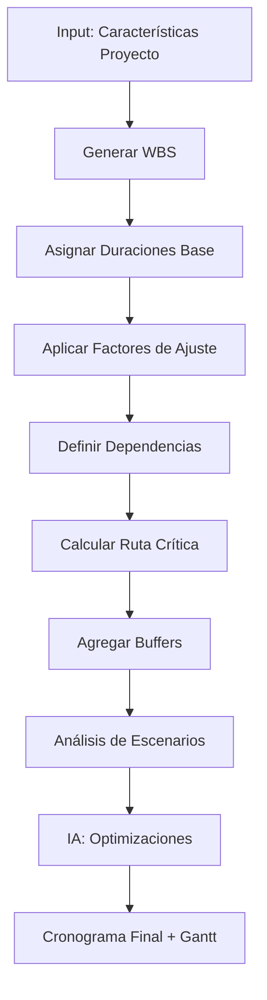

# Herramienta de Estimación de Tiempos

## Descripción General

Sistema inteligente de planificación que genera cronogramas realistas de proyecto inmobiliario, considerando secuencias constructivas, rendimientos, disponibilidad de recursos, clima y factores de riesgo mediante IA predictiva.

---

## Funcionalidades Principales

### 1. Cronograma de Construcción
- **Fases y actividades:** Desglose WBS (Work Breakdown Structure)
- **Secuencias lógicas:** Dependencias entre actividades
- **Rendimientos estándar:** Basados en datos históricos
- **Ruta crítica:** Actividades que no pueden retrasarse
- **Holguras:** Tiempo disponible para actividades no críticas

### 2. Cronograma de Permisos y Trámites
- **Trámites requeridos:** Lista completa por jurisdicción
- **Tiempos oficiales vs reales:** Basado en experiencia real
- **Dependencias:** Secuencia obligatoria de trámites
- **Paralelización:** Trámites que se pueden hacer simultáneamente
- **Días hábiles vs calendario:** Ajuste automático

### 3. Factores de Ajuste
- **Complejidad del proyecto:** Multiplicadores por dificultad
- **Clima y estacionalidad:** Impacto de lluvias, calor extremo
- **Disponibilidad de mano de obra:** Escasez por temporada alta
- **Acceso al sitio:** Restricciones de tráfico, horarios
- **Experiencia del constructor:** Ajuste por curva de aprendizaje

### 4. Gestión de Riesgos de Tiempo
- **Probabilidad de retrasos:** Por actividad
- **Reservas de contingencia:** Buffers de tiempo recomendados
- **Escenarios de timeline:** Optimista, probable, pesimista
- **Alertas tempranas:** Indicadores de posible retraso

---

## Inputs Requeridos

```yaml
proyecto:
  tipo: "residencial_multifamiliar"
  area_construccion_m2: 2400
  niveles: 5
  unidades: 16
  complejidad: "media"  # baja, media, alta

ubicacion:
  ciudad: "Ciudad de México"
  zona: "Polanco"
  acceso: "urbano_facil"  # rural, urbano_dificil, urbano_facil

caracteristicas:
  estructura: "concreto_armado"
  acabados: "medio"  # economico, medio, premium
  instalaciones: ["electrica", "hidraulica", "gas", "clima", "domótica"]
  estacionamiento: "subterraneo"  # superficie, subterraneo, no

equipo:
  constructor_experiencia: "alta"  # baja, media, alta
  cuadrillas_simultaneas: 3
  jornada: "normal"  # normal, extendida, turnos

fechas:
  fecha_inicio_deseada: "2024-11-15"
  fecha_entrega_objetivo: "2026-03-15"  # Opcional

permisos:
  licencia_construccion: "pendiente"  # obtenida, tramite, pendiente
  otros_permisos: []
```

---

## Outputs Generados

### Cronograma Maestro

```json
{
  "resumen_ejecutivo": {
    "duracion_total_dias": 485,
    "duracion_meses": 16.2,
    "fecha_inicio": "2024-11-15",
    "fecha_termino": "2026-04-15",
    "desviacion_objetivo": "+30 días",
    "holgura_total_proyecto": 15,
    "probabilidad_cumplir_objetivo": 72
  },

  "fases_principales": [
    {
      "fase": "1. Pre-construcción",
      "duracion_dias": 75,
      "inicio": "2024-11-15",
      "fin": "2025-01-29",
      "porcentaje_proyecto": 15.5,
      "ruta_critica": true
    },
    {
      "fase": "2. Cimentación",
      "duracion_dias": 45,
      "inicio": "2025-01-30",
      "fin": "2025-03-16",
      "porcentaje_proyecto": 9.3,
      "ruta_critica": true
    },
    {
      "fase": "3. Estructura",
      "duracion_dias": 120,
      "inicio": "2025-03-17",
      "fin": "2025-07-15",
      "porcentaje_proyecto": 24.7,
      "ruta_critica": true
    },
    {
      "fase": "4. Albañilería",
      "duracion_dias": 80,
      "inicio": "2025-06-16",
      "fin": "2025-09-04",
      "porcentaje_proyecto": 16.5,
      "ruta_critica": false,
      "holgura_dias": 15
    },
    {
      "fase": "5. Instalaciones",
      "duracion_dias": 70,
      "inicio": "2025-08-05",
      "fin": "2025-10-14",
      "porcentaje_proyecto": 14.4,
      "ruta_critica": false,
      "holgura_dias": 10
    },
    {
      "fase": "6. Acabados",
      "duracion_dias": 90,
      "inicio": "2025-09-15",
      "fin": "2025-12-14",
      "porcentaje_proyecto": 18.6,
      "ruta_critica": true
    },
    {
      "fase": "7. Finales y Entrega",
      "duracion_dias": 30,
      "inicio": "2025-12-15",
      "fin": "2026-01-14",
      "porcentaje_proyecto": 6.2,
      "ruta_critica": true
    }
  ],

  "cronograma_detallado": [
    {
      "actividad": "Tramitar licencia de construcción",
      "fase": "Pre-construcción",
      "duracion_dias": 60,
      "inicio": "2024-11-15",
      "fin": "2025-01-14",
      "predecesoras": [],
      "recursos": ["Gestor", "Documentación"],
      "costo": 85000,
      "ruta_critica": true,
      "holgura": 0,
      "probabilidad_retraso": 35,
      "factores_riesgo": ["Documentación incompleta", "Carga de trabajo SEDUVI"]
    },
    {
      "actividad": "Limpieza y trazo",
      "fase": "Pre-construcción",
      "duracion_dias": 3,
      "inicio": "2025-01-27",
      "fin": "2025-01-29",
      "predecesoras": ["Licencia de construcción", "Liberación de terreno"],
      "recursos": ["Topógrafo", "Ayudantes(4)"],
      "costo": 15000,
      "ruta_critica": true,
      "holgura": 0
    },
    {
      "actividad": "Excavación para cimentación",
      "fase": "Cimentación",
      "duracion_dias": 8,
      "inicio": "2025-01-30",
      "fin": "2025-02-06",
      "predecesoras": ["Limpieza y trazo"],
      "recursos": ["Retroexcavadora", "Operador", "Ayudantes(6)"],
      "rendimiento": "300 m³/día",
      "costo": 120000,
      "ruta_critica": true,
      "holgura": 0
    }
    // ... 150+ actividades más
  ],

  "ruta_critica": {
    "actividades": [
      "Tramitar licencia",
      "Limpieza y trazo",
      "Excavación",
      "Cimentación",
      "Estructura nivel 1",
      "Estructura nivel 2",
      "...",
      "Acabados finales",
      "Certificado de habitabilidad"
    ],
    "duracion_total": 470,
    "margen_error": 0,
    "recomendacion": "Monitorear diariamente. Cualquier retraso impacta fecha final."
  },

  "paralelizacion": {
    "actividades_simultaneas_max": 8,
    "ejemplo_mes_6": [
      "Estructura nivel 3",
      "Muros nivel 2",
      "Instalación eléctrica nivel 1",
      "Instalación hidráulica nivel 1",
      "Impermeabilización nivel sótano"
    ]
  },

  "cronograma_permisos": [
    {
      "tramite": "Licencia de construcción",
      "duracion_oficial": 40,
      "duracion_real_promedio": 60,
      "duracion_estimada": 60,
      "inicio": "2024-11-15",
      "fin": "2025-01-14",
      "dependencias": ["Proyecto ejecutivo", "Pagos de derechos"],
      "critico": true
    },
    {
      "tramite": "Visto bueno Protección Civil",
      "duracion_oficial": 15,
      "duracion_real_promedio": 20,
      "duracion_estimada": 20,
      "inicio": "2025-06-01",
      "fin": "2025-06-21",
      "dependencias": ["Avance de obra 50%"],
      "critico": false
    }
    // ... más trámites
  ],

  "factores_ajuste_aplicados": {
    "complejidad_media": 1.15,
    "zona_urbana_congestionada": 1.08,
    "temporada_lluvias": 1.12,
    "constructor_experimentado": 0.92,
    "ajuste_neto": 1.28
  },

  "analisis_clima": {
    "temporada_lluvias": {
      "periodo": "Mayo-Octubre",
      "impacto": "Retrasos en actividades exteriores",
      "dias_perdidos_estimados": 18,
      "mitigacion": "Adelantar obra exterior, programar interiores en lluvias"
    },
    "festivos_considerados": [
      "Navidad/Año Nuevo (10 días)",
      "Semana Santa (5 días)",
      "Puentes largos (4 días)"
    ]
  },

  "reservas_contingencia": {
    "buffer_general": 30,
    "ubicacion_buffer": "Final del proyecto",
    "buffers_actividades_criticas": {
      "Tramitar licencia": 10,
      "Estructura": 15,
      "Acabados": 10
    },
    "total_contingencia": 55
  },

  "escenarios": {
    "optimista": {
      "duracion_dias": 435,
      "probabilidad": 15,
      "supuestos": [
        "Licencia en 45 días (vs 60)",
        "Sin retrasos climáticos",
        "100% disponibilidad de materiales"
      ]
    },
    "probable": {
      "duracion_dias": 485,
      "probabilidad": 60,
      "supuestos": [
        "Licencia en 60 días",
        "Retrasos climáticos moderados",
        "Disponibilidad normal de recursos"
      ]
    },
    "pesimista": {
      "duracion_dias": 560,
      "probabilidad": 25,
      "supuestos": [
        "Licencia en 80+ días",
        "Retrasos climáticos severos",
        "Escasez de materiales clave"
      ]
    }
  },

  "hitos_clave": [
    {
      "hito": "Obtención de licencia",
      "fecha": "2025-01-14",
      "importancia": "Crítica",
      "entregable": "Licencia de construcción autorizada"
    },
    {
      "hito": "Término de estructura",
      "fecha": "2025-07-15",
      "importancia": "Alta",
      "entregable": "Estructura completa, inicio de cerramientos"
    },
    {
      "hito": "Unidades modelo terminadas",
      "fecha": "2025-10-31",
      "importancia": "Alta",
      "entregable": "2 unidades modelo para ventas"
    },
    {
      "hito": "Entrega de obra",
      "fecha": "2026-04-15",
      "importancia": "Crítica",
      "entregable": "Certificado de habitabilidad, entrega a clientes"
    }
  ],

  "indicadores_seguimiento": {
    "spi_objetivo": 1.0,
    "alertas": [
      {
        "tipo": "SPI < 0.95",
        "accion": "Revisar causas, plan de aceleración"
      },
      {
        "tipo": "Actividad ruta crítica retrasada >5 días",
        "accion": "Asignar recursos adicionales, turnos extra"
      }
    ]
  },

  "recomendaciones": [
    "Iniciar trámite de licencia INMEDIATAMENTE (ruta crítica)",
    "Adelantar compra de acero para asegurar disponibilidad",
    "Programar actividades de fachadas antes de temporada lluvias",
    "Contratar gestor experimentado para agilizar permisos",
    "Considerar turno extendido en estructura para recuperar 10 días"
  ]
}
```

---

## Stack Tecnológico

### Backend
- **Python + FastAPI**
- **Pandas:** Manejo de cronogramas
- **NetworkX:** Análisis de ruta crítica y dependencias
- **APScheduler:** Actualización de cronogramas en tiempo real

### Algoritmos de Planificación
- **CPM (Critical Path Method):** Ruta crítica
- **PERT (Program Evaluation Review Technique):** Estimación probabilística
- **Monte Carlo:** Simulación de duración del proyecto
- **Genetic Algorithms:** Optimización de recursos

### Machine Learning
- **Random Forest:** Predicción de duraciones basada en histórico
- **LSTM Networks:** Series temporales de avance de obra
- **XGBoost:** Clasificación de probabilidad de retraso

### Visualización
- **Plotly:** Gráficas de Gantt interactivas
- **Matplotlib:** Diagramas de red (PERT/CPM)
- **D3.js:** Visualización de ruta crítica

### Integraciones
- **MS Project:** Import/export de cronogramas
- **Primavera P6:** Compatibilidad con estándar de construcción
- **Google Calendar:** Sincronización de hitos
- **APIs de clima:** Predicción meteorológica

---

## Flujo de Trabajo



---

## Casos de Uso

### Caso 1: Planificación Inicial de Proyecto
**Escenario:** Desarrollador planea proyecto, necesita cronograma para financiamiento
- **Input:** Características básicas del proyecto
- **Output:** Cronograma detallado con fechas clave
- **Valor:** Presentación profesional a banco, aprobación más rápida

### Caso 2: Seguimiento de Obra
**Escenario:** Constructor actualiza avance semanal, compara vs plan
- **Input:** % avance real por actividad
- **Output:** Dashboard con SPI, alertas, proyección nueva de término
- **Valor:** Detección temprana de retrasos, acciones correctivas oportunas

### Caso 3: Aceleración de Proyecto
**Escenario:** Cliente pide entregar 2 meses antes
- **Input:** Cronograma actual + objetivo nuevo
- **Output:** Opciones de aceleración (costo vs tiempo)
- **Valor:** Decisión informada, cumplir nueva fecha sin impacto económico excesivo

---

## Módulos Especializados

### 1. Generador de WBS
```python
# Pseudo-código
class GeneradorWBS:
    def __init__(self, tipo_proyecto):
        self.plantilla = cargar_plantilla(tipo_proyecto)

    def generar_actividades(self, caracteristicas):
        actividades = []

        # Fase 1: Pre-construcción
        actividades.extend(self.preconstruccion(caracteristicas))

        # Fase 2: Cimentación
        if caracteristicas.get('sotano'):
            actividades.extend(self.cimentacion_profunda())
        else:
            actividades.extend(self.cimentacion_superficial())

        # Fase 3: Estructura
        niveles = caracteristicas.get('niveles')
        for nivel in range(niveles):
            actividades.extend(self.estructura_nivel(nivel))

        # ... más fases

        return actividades
```

### 2. Calculador de Ruta Crítica (CPM)
- Implementación de algoritmo CPM
- Cálculo de early start, late start, holguras
- Identificación de actividades críticas
- Visualización en diagrama de red

### 3. Simulador Monte Carlo
- 10,000 iteraciones de cronograma
- Variables aleatorias: duraciones, clima, disponibilidad
- Output: Distribución probabilística de fecha de término
- Recomendación de buffer óptimo

---

## Rendimientos Estándar (Ejemplos)

### Estructura
- **Concreto en losa:** 1.2 días/nivel (200 m² por nivel)
- **Concreto en columnas:** 0.8 días/nivel
- **Concreto en trabes:** 1.0 día/nivel
- **Armado de acero:** 2.5 días/nivel

### Albañilería
- **Muros de block:** 15 m²/día por cuadrilla
- **Aplanados:** 25 m²/día por cuadrilla
- **Impermeabilización:** 50 m²/día

### Instalaciones
- **Eléctrica:** 80 m²/día por electricista
- **Hidráulica:** 60 m²/día por plomero
- **Aire acondicionado:** 40 m²/día por técnico

_Nota: Rendimientos ajustados por complejidad y experiencia_

---

## Factores de Ajuste

| Factor | Rango | Impacto |
|--------|-------|---------|
| Complejidad del proyecto | 0.85 - 1.40 | Alto |
| Experiencia del constructor | 0.90 - 1.25 | Alto |
| Disponibilidad de mano de obra | 0.95 - 1.20 | Medio |
| Clima (lluvias, calor) | 1.00 - 1.30 | Medio |
| Acceso al sitio | 1.00 - 1.15 | Bajo |
| Jornada laboral | 0.75 - 1.00 | Medio |

---

## Integraciones

- **Herramienta de Costos:** Crash program (acelerar con sobrecosto)
- **Proyecciones Financieras:** Impacto de tiempos en flujo de caja
- **Análisis de Zonificación:** Tiempos de permisos actualizados
- **Software de construcción:** Procore, PlanGrid, Buildertrend

---

## Reportes Generados

### 1. Diagrama de Gantt
- Vista gráfica de todas las actividades
- Código de colores por fase
- Indicación de ruta crítica
- Hitos clave destacados

### 2. Diagrama de Red (PERT/CPM)
- Visualización de dependencias
- Early/Late start & finish
- Holguras
- Ruta crítica resaltada

### 3. Curva S de Avance
- Avance planeado vs real
- Proyección de término
- Indicadores SPI (Schedule Performance Index)

### 4. Dashboard Ejecutivo
- Progreso general (%)
- Días adelante/atraso
- Próximos hitos (30 días)
- Alertas críticas

---

## Mejoras Futuras

- [ ] Integración con IoT en obra (sensores de avance)
- [ ] IA que aprende de retrasos para mejorar estimaciones
- [ ] Optimización automática de recursos (cuadrillas, equipos)
- [ ] Realidad aumentada para visualizar cronograma en sitio
- [ ] Blockchain para trazabilidad de avance certificado

---

## KPIs del Sistema

- **Precisión de estimación:** ±10% en duración total
- **Velocidad de generación:** <10 segundos
- **Satisfacción de usuarios:** 8.9/10
- **Reducción de retrasos:** 35% vs planificación manual

---

## Enlaces Relacionados

- [[../06-Calculo-ROI/ROI-RENTABILIDAD-METRICAS-FINANCIERAS|Anterior: Cálculo de ROI]]
- [[../08-Analisis-Riesgos/RIESGOS-MITIGACION-MATRIZ|Siguiente: Análisis de Riesgos]]
- [[../../03-Recursos/Rendimientos-Construccion|Recursos: Rendimientos]]
