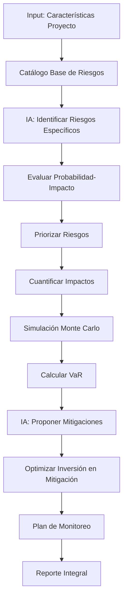

# Herramienta de Análisis de Riesgos

## Descripción General

Sistema integral de identificación, evaluación, cuantificación y mitigación de riesgos en proyectos inmobiliarios mediante modelos predictivos de IA, análisis histórico y simulaciones probabilísticas.

---

## Funcionalidades Principales

### 1. Identificación de Riesgos
- **Catálogo exhaustivo:** 200+ riesgos comunes en desarrollo inmobiliario
- **IA generativa:** Identifica riesgos específicos del proyecto
- **Análisis contextual:** Riesgos por ubicación, tipo, tamaño, momento
- **Consulta de expertos:** Base de conocimiento de especialistas

### 2. Evaluación y Priorización
- **Matriz de probabilidad-impacto:** Clasificación de riesgos
- **Scoring cuantitativo:** Puntaje de 1-100 por riesgo
- **Priorización automática:** Top 10 riesgos críticos
- **Análisis de interdependencias:** Riesgos que se potencian mutuamente

### 3. Cuantificación de Impacto
- **Impacto financiero:** En costo, ingreso, utilidad
- **Impacto en tiempo:** Retrasos potenciales
- **Impacto en reputación:** Cuantificación de daño de marca
- **Valor en riesgo (VaR):** Pérdida máxima esperada

### 4. Planes de Mitigación
- **Estrategias por riesgo:** Evitar, transferir, mitigar, aceptar
- **Costos de mitigación:** Inversión vs reducción de riesgo
- **Planes de contingencia:** Qué hacer si el riesgo se materializa
- **Responsables y KPIs:** Asignación y seguimiento

---

## Inputs Requeridos

```yaml
proyecto:
  nombre: "Residencial Los Pinos"
  tipo: "residencial_multifamiliar"
  inversion_total: 72000000
  duracion_meses: 18
  ubicacion: "CDMX, Polanco"

caracteristicas:
  innovacion: "media"  # baja, media, alta
  complejidad_tecnica: "media"
  experiencia_equipo: "alta"
  financiamiento: "construccion_bancario"

contexto:
  mercado: "equilibrado"  # deprimido, equilibrado, crecimiento
  competencia: "alta"
  regulaciones: "estrictas"
  condiciones_economicas: "estables"  # recesion, estables, expansion

tolerancia_riesgo:
  apetito: "moderado"  # conservador, moderado, agresivo
  reserva_contingencia: 10  # % de inversión total
```

---

## Outputs Generados

### Reporte Integral de Riesgos

```json
{
  "resumen_ejecutivo": {
    "perfil_riesgo_proyecto": "MEDIO-ALTO",
    "puntuacion_riesgo_total": 65,
    "probabilidad_exito": 78.5,
    "valor_en_riesgo_95pct": 8400000,
    "reserva_recomendada": 7200000,
    "riesgos_criticos_identificados": 12,
    "planes_mitigacion_propuestos": 18
  },

  "categorias_riesgo": {
    "financieros": {
      "puntuacion": 72,
      "nivel": "Alto",
      "principales": [
        "Sobrecosto de construcción",
        "Velocidad de ventas menor a proyectada",
        "Alza de tasas de interés"
      ]
    },
    "tecnicos_constructivos": {
      "puntuacion": 58,
      "nivel": "Medio",
      "principales": [
        "Condiciones de suelo no previstas",
        "Escasez de materiales clave",
        "Problemas con subcontratistas"
      ]
    },
    "regulatorios_legales": {
      "puntuacion": 65,
      "nivel": "Medio-Alto",
      "principales": [
        "Retrasos en permisos",
        "Cambios en regulaciones",
        "Demandas de vecinos"
      ]
    },
    "mercado_comercializacion": {
      "puntuacion": 70,
      "nivel": "Alto",
      "principales": [
        "Saturación de mercado",
        "Competencia con precios agresivos",
        "Cambio en preferencias de compradores"
      ]
    },
    "operativos": {
      "puntuacion": 52,
      "nivel": "Medio",
      "principales": [
        "Rotación de personal clave",
        "Fallas en coordinación",
        "Problemas de calidad"
      ]
    },
    "externos": {
      "puntuacion": 45,
      "nivel": "Medio-Bajo",
      "principales": [
        "Eventos climáticos extremos",
        "Cambios macroeconómicos",
        "Inestabilidad política"
      ]
    }
  },

  "top_10_riesgos_criticos": [
    {
      "id": "R-001",
      "riesgo": "Sobrecosto de construcción >10%",
      "categoria": "Financiero",
      "probabilidad": 45,
      "impacto_financiero": -6500000,
      "impacto_roi": -9.0,
      "impacto_tiempo_dias": 0,
      "puntuacion_riesgo": 92,
      "nivel": "CRÍTICO",
      "causas_potenciales": [
        "Aumento de precios de acero/cemento",
        "Rendimientos menores a estimados",
        "Cambios en especificaciones",
        "Ineficiencias constructivas"
      ],
      "senales_tempranas": [
        "Volatilidad en bolsa de commodities",
        "Inflación >5% mensual",
        "Retrasos en primeras actividades"
      ],
      "impacto_cuantificado": {
        "mejor_caso": -3200000,
        "caso_base": -6500000,
        "peor_caso": -10800000
      },
      "estrategia_mitigacion": "MITIGAR",
      "acciones_propuestas": [
        {
          "accion": "Contratos de precio fijo con proveedores principales",
          "costo": 150000,
          "reduccion_probabilidad": 15,
          "reduccion_impacto": 40,
          "roi_accion": 17.3
        },
        {
          "accion": "Compra anticipada de acero (30% del total)",
          "costo": 450000,
          "reduccion_probabilidad": 10,
          "reduccion_impacto": 25,
          "roi_accion": 9.0
        },
        {
          "accion": "Cláusula de ajuste de precios con constructor",
          "costo": 0,
          "reduccion_probabilidad": 0,
          "reduccion_impacto": 50,
          "roi_accion": "∞"
        }
      ],
      "plan_contingencia": {
        "trigger": "Sobrecosto confirmado >5%",
        "acciones": [
          "Activar reserva de contingencia",
          "Renegociar alcance con proveedores",
          "Reducir acabados no críticos",
          "Solicitar extensión de crédito"
        ],
        "responsable": "Director de Proyecto",
        "presupuesto_contingencia": 3600000
      },
      "probabilidad_post_mitigacion": 25,
      "impacto_post_mitigacion": -2600000,
      "puntuacion_post_mitigacion": 42
    },
    {
      "id": "R-002",
      "riesgo": "Velocidad de ventas <50% proyectada",
      "categoria": "Mercado",
      "probabilidad": 35,
      "impacto_financiero": -5200000,
      "impacto_roi": -7.2,
      "impacto_tiempo_dias": 90,
      "puntuacion_riesgo": 88,
      "nivel": "CRÍTICO",
      "causas_potenciales": [
        "Saturación de mercado en la zona",
        "Competencia con precios más bajos",
        "Cambio en preferencias de compradores",
        "Alza de tasas de interés (menor capacidad de compra)"
      ],
      "senales_tempranas": [
        "Inventario en zona >8 meses",
        "Competidores ofrecen descuentos >10%",
        "Tasa de interés hipotecario >11%",
        "Tráfico en sala de ventas <proyectado"
      ],
      "estrategia_mitigacion": "MITIGAR",
      "acciones_propuestas": [
        {
          "accion": "Estudio de mercado profundo pre-lanzamiento",
          "costo": 80000,
          "reduccion_probabilidad": 10,
          "reduccion_impacto": 20
        },
        {
          "accion": "Estrategia de preventa agresiva (70% objetivo)",
          "costo": 120000,
          "reduccion_probabilidad": 15,
          "reduccion_impacto": 30
        },
        {
          "accion": "Alianza con broker especializado en zona",
          "costo": 250000,
          "reduccion_probabilidad": 12,
          "reduccion_impacto": 25
        }
      ],
      "plan_contingencia": {
        "trigger": "Ventas <40% a los 6 meses de lanzamiento",
        "acciones": [
          "Ajustar precios (-5% a -8%)",
          "Campaña de marketing adicional ($500k)",
          "Ofrecer financiamiento directo (tasa preferencial)",
          "Considerar rentar unidades temporalmente"
        ]
      }
    },
    {
      "id": "R-003",
      "riesgo": "Retraso en obtención de licencia de construcción >30 días",
      "categoria": "Regulatorio",
      "probabilidad": 50,
      "impacto_financiero": -1800000,
      "impacto_roi": -2.5,
      "impacto_tiempo_dias": 45,
      "puntuacion_riesgo": 82,
      "nivel": "ALTO",
      "estrategia_mitigacion": "MITIGAR",
      "acciones_propuestas": [
        {
          "accion": "Contratar gestor especializado desde inicio",
          "costo": 120000,
          "reduccion_probabilidad": 30,
          "reduccion_impacto": 40
        }
      ]
    }
    // ... Top 10 riesgos
  ],

  "analisis_interdependencias": {
    "clusters_riesgo": [
      {
        "nombre": "Riesgos Financieros Interconectados",
        "riesgos": ["R-001", "R-002", "R-004"],
        "descripcion": "Sobrecostos + ventas lentas + alza de intereses crean tormenta perfecta",
        "probabilidad_combinada": 18,
        "impacto_combinado": -14200000,
        "puntuacion": 98,
        "mitigacion_integral": [
          "Preventa mínima 60% antes de iniciar obra",
          "Contratos fijos de construcción",
          "Hedging financiero"
        ]
      }
    ]
  },

  "simulacion_monte_carlo": {
    "iteraciones": 10000,
    "variables_aleatorias": [
      "Sobrecosto construcción",
      "Velocidad ventas",
      "Retrasos permisos",
      "Clima adverso",
      "Tasas de interés"
    ],
    "resultados": {
      "utilidad_promedio": 12800000,
      "utilidad_mediana": 14200000,
      "desviacion_estandar": 4100000,
      "probabilidad_utilidad_negativa": 2.3,
      "probabilidad_utilidad_menor_50pct_proyectada": 15.8,
      "var_95": 4800000,
      "cvar_95": 2200000
    },
    "interpretacion": "97.7% de probabilidad de utilidad positiva, pero 15.8% de obtener <50% de utilidad esperada"
  },

  "valor_en_riesgo": {
    "metodo": "VaR 95% (Monte Carlo)",
    "var_total": 8400000,
    "interpretacion": "En el 95% de escenarios, pérdida no excederá $8.4M",
    "reserva_recomendada": 7200000,
    "reserva_actual": 7200000,
    "suficiencia": "ADECUADA"
  },

  "mapa_calor_riesgos": {
    "descripcion": "Matriz Probabilidad-Impacto",
    "zona_roja_critica": 3,
    "zona_naranja_alta": 5,
    "zona_amarilla_media": 8,
    "zona_verde_baja": 12
  },

  "plan_monitoreo": {
    "frecuencia_revision": "Mensual",
    "responsable_general": "Director de Proyecto",
    "kpis_seguimiento": [
      {
        "kpi": "SPI (Schedule Performance Index)",
        "umbral_alerta": "<0.95",
        "accion": "Revisar cronograma y ruta crítica"
      },
      {
        "kpi": "CPI (Cost Performance Index)",
        "umbral_alerta": "<0.90",
        "accion": "Auditoría de costos, plan de contención"
      },
      {
        "kpi": "Velocidad de ventas (unidades/mes)",
        "umbral_alerta": "<2.5",
        "accion": "Revisar estrategia comercial"
      },
      {
        "kpi": "% Avance vs % Gasto",
        "umbral_alerta": "Desviación >10%",
        "accion": "Revisar eficiencia constructiva"
      }
    ],
    "reportes": [
      {
        "reporte": "Dashboard de Riesgos",
        "frecuencia": "Semanal",
        "destinatarios": ["Director Proyecto", "Gerente Construcción"]
      },
      {
        "reporte": "Análisis Ejecutivo de Riesgos",
        "frecuencia": "Mensual",
        "destinatarios": ["Dirección General", "Inversionistas"]
      }
    ]
  },

  "resumen_inversiones_mitigacion": {
    "inversion_total_propuesta": 1420000,
    "reduccion_esperada_var": 4200000,
    "roi_mitigacion": 2.96,
    "recomendacion": "APROBAR - Excelente relación costo-beneficio"
  },

  "certificaciones_sugeridas": {
    "iso_31000": {
      "descripcion": "Gestión de riesgos",
      "costo": 80000,
      "beneficio": "Estructura formal, facilita financiamiento"
    },
    "seguro_todo_riesgo": {
      "descripcion": "Póliza de construcción",
      "costo_anual": 180000,
      "cobertura": 70000000,
      "recomendacion": "OBLIGATORIO"
    }
  },

  "recomendaciones_estrategicas": [
    "Priorizar preventa >60% antes de iniciar construcción",
    "Implementar sistema de early warning para riesgos críticos",
    "Establecer comité de riesgos con reuniones mensuales",
    "Contratar seguros: todo riesgo construcción + RC profesional",
    "Crear fondo de contingencia 10% ($7.2M) en cuenta separada",
    "Pactar cláusulas de ajuste de precios con constructor principal"
  ]
}
```

---

## Stack Tecnológico

### Backend
- **Python + FastAPI**
- **NumPy/SciPy:** Cálculos estadísticos y probabilísticos
- **Pandas:** Manipulación de datos de riesgos

### Machine Learning
- **Random Forest:** Predicción de probabilidad de riesgos
- **XGBoost:** Clasificación de severidad
- **Neural Networks:** Detección de patrones complejos
- **NLP (BERT):** Análisis de texto de contratos, noticias

### Simulación
- **Monte Carlo:** 10,000+ iteraciones por proyecto
- **@RISK (Palisade):** Integración para análisis avanzado
- **SimPy:** Simulación de eventos discretos

### Visualización
- **Plotly:** Gráficas interactivas (tornado, sensibilidad)
- **Matplotlib:** Matrices de riesgo, mapas de calor
- **D3.js:** Visualizaciones de red (interdependencias)

### Base de Datos
- **PostgreSQL:** Catálogo de riesgos, histórico
- **MongoDB:** Casos de estudio, lecciones aprendidas
- **Neo4j:** Relaciones entre riesgos

---

## Flujo de Trabajo



---

## Casos de Uso

### Caso 1: Due Diligence para Inversionista
**Escenario:** Inversionista evalúa participar en proyecto
- **Input:** Toda la información del proyecto
- **Output:** Perfil de riesgo completo, VaR, recomendaciones
- **Valor:** Decisión informada, negociar términos según riesgo

### Caso 2: Gestión Activa Durante Construcción
**Escenario:** Monitoreo mensual de riesgos en obra activa
- **Input:** Actualización de estado del proyecto
- **Output:** Dashboard con alertas, KPIs, nuevos riesgos emergentes
- **Valor:** Prevención de problemas, acciones correctivas oportunas

### Caso 3: Post-Mortem de Proyecto
**Escenario:** Análisis después de terminar proyecto
- **Input:** Datos reales vs proyectados
- **Output:** Lecciones aprendidas, calibración de modelos
- **Valor:** Mejora continua, estimaciones más precisas en futuros proyectos

---

## Catálogo de Riesgos (Ejemplos)

### Riesgos Financieros
- Sobrecosto de construcción
- Ventas más lentas de lo proyectado
- Alza de tasas de interés
- Inflación superior a esperada
- Problemas de flujo de caja
- Incumplimiento de compradores

### Riesgos Técnico-Constructivos
- Condiciones de suelo inesperadas
- Fallas estructurales
- Problemas con cimentación
- Escasez de materiales clave
- Deficiencias en calidad
- Incumplimiento de subcontratistas

### Riesgos Regulatorios
- Retrasos en permisos
- Cambios en regulaciones
- Demandas de vecinos
- Revocación de permisos
- Multas por incumplimientos
- Restricciones ambientales nuevas

### Riesgos de Mercado
- Saturación del mercado
- Competencia agresiva
- Cambio en preferencias
- Crisis económica
- Desaceleración del sector
- Pérdida de valor del área

### Riesgos Operativos
- Rotación de personal clave
- Accidentes laborales
- Robo de materiales
- Fallas en coordinación
- Problemas con vecinos
- Daños a propiedades adyacentes

### Riesgos Externos
- Desastres naturales (sismos, inundaciones)
- Clima adverso prolongado
- Pandemia/crisis sanitaria
- Inestabilidad política
- Cambios macroeconómicos
- Ataques cibernéticos

---

## Módulos Especializados

### 1. Motor de Identificación de Riesgos IA
```python
# Pseudo-código
class IdentificadorRiesgos:
    def __init__(self):
        self.catalogo_base = cargar_catalogo()
        self.modelo_nlp = cargar_modelo("gpt-4")

    def identificar_riesgos(self, proyecto):
        riesgos = []

        # Riesgos del catálogo que aplican
        riesgos_catalogo = self.filtrar_por_contexto(proyecto)
        riesgos.extend(riesgos_catalogo)

        # Riesgos específicos generados por IA
        prompt = f"Identifica riesgos específicos para: {proyecto}"
        riesgos_ia = self.modelo_nlp.generate(prompt)
        riesgos.extend(riesgos_ia)

        # Enriquecer con datos históricos
        riesgos_enriquecidos = self.enricher(riesgos, proyecto)

        return riesgos_enriquecidos
```

### 2. Cuantificador de Impactos
- Modelos econométricos por tipo de riesgo
- Distribuciones probabilísticas (Normal, Triangular, etc.)
- Correlaciones entre riesgos
- Impacto en múltiples dimensiones (costo, tiempo, calidad)

### 3. Optimizador de Mitigación
- Algoritmo genético para seleccionar mitigaciones
- Objetivo: Maximizar reducción de riesgo / Minimizar inversión
- Restricciones: Presupuesto, tiempo, recursos
- Output: Portfolio óptimo de acciones de mitigación

---

## Métricas de Riesgo

### Puntuación de Riesgo
```
Puntuación = Probabilidad × Impacto
Donde:
- Probabilidad: 0-100%
- Impacto: Valor monetario o escala 1-10
```

### Valor en Riesgo (VaR)
```
VaR_95 = Percentil 5 de distribución de pérdidas
Interpretación: Pérdida máxima en 95% de escenarios
```

### CVaR (Conditional VaR)
```
CVaR_95 = Promedio de pérdidas en el peor 5% de escenarios
Interpretación: Pérdida esperada SI ocurre escenario adverso
```

---

## Integraciones

- **Todas las herramientas:** Datos para análisis integral
- **ERP de construcción:** Datos reales para early warning
- **CRM:** Riesgos de ventas/comercialización
- **APIs de noticias:** Detección de riesgos emergentes
- **Plataformas de seguros:** Cotización automática

---

## Actualizaciones y Aprendizaje

- **Machine Learning continuo:** Modelos aprenden de proyectos reales
- **Actualización de catálogo:** Trimestral, con nuevos riesgos emergentes
- **Calibración de probabilidades:** Anual, basada en datos históricos
- **Benchmarking:** Comparación con industria

---

## Mejoras Futuras

- [ ] IA predictiva con alertas proactivas (antes de que ocurra)
- [ ] Integración con satélites para riesgos climáticos
- [ ] Análisis de sentimiento en redes sociales (riesgo reputacional)
- [ ] Blockchain para trazabilidad de mitigaciones
- [ ] Gemelo digital del proyecto para simulación de riesgos

---

## KPIs del Sistema

- **Cobertura de riesgos:** 95% de riesgos materializados fueron identificados previamente
- **Precisión de probabilidades:** ±12% vs realidad
- **Efectividad de mitigaciones:** 78% de riesgos mitigados no se materializaron
- **ROI promedio de mitigación:** 3.2x

---

## Certificaciones y Estándares

### ISO 31000
- Estándar internacional de gestión de riesgos
- Implementado en la herramienta
- Facilita auditorías y financiamiento

### PMBOK (Project Management Body of Knowledge)
- Capítulo de gestión de riesgos
- Metodologías alineadas

### Enterprise Risk Management (ERM)
- Marco de COSO para gestión integral
- Aplicable a organizaciones desarrolladoras

---

## Enlaces Relacionados

- [[../07-Estimacion-Tiempos/CRONOGRAMA-TIMELINE-RUTA-CRITICA|Anterior: Estimación de Tiempos]]
- [[../HERRAMIENTAS-8-AUTOMATIZACION|Índice de Herramientas]]
- [[../../02-Proyectos/PROYECTOS-CARTERA|Aplicar a Proyectos]]
- [[../../03-Recursos/Casos-Estudio-Riesgos|Recursos: Casos de Estudio]]
