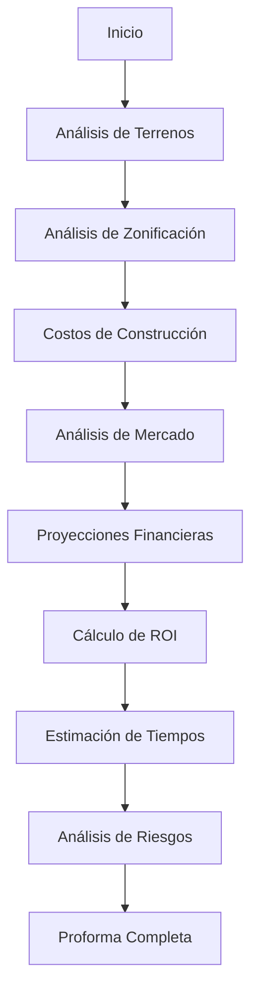

# Herramientas para Automatización de Proformas Inmobiliarias

Este directorio contiene todas las herramientas necesarias para automatizar cada una de las tareas individuales de una proforma inmobiliaria inteligente.

## Índice de Herramientas

### 1. [[01-Analisis-Terrenos/TERRENOS-ANALISIS-UBICACION-VIABILIDAD|Análisis de Terrenos]]
Herramientas para evaluar viabilidad, ubicación y valoración de terrenos.

### 2. [[02-Costos-Construccion/COSTOS-PRESUPUESTO-MATERIALES|Costos de Construcción]]
Calculadoras y estimadores de costos de materiales, mano de obra y equipos.

### 3. [[03-Analisis-Mercado/MERCADO-DEMANDA-PRECIOS-ABSORCION|Análisis de Mercado]]
Herramientas para estudiar tendencias, demanda y precios del mercado inmobiliario.

### 4. [[04-Proyecciones-Financieras/FINANCIERO-FLUJO-CAJA-PROFORMA|Proyecciones Financieras]]
Modelos financieros para proyectar ingresos, gastos y flujo de caja.

### 5. [[05-Analisis-Zonificacion/ZONIFICACION-REGULACIONES-PERMISOS|Análisis de Zonificación]]
Verificación de regulaciones, permisos y restricciones legales.

### 6. [[06-Calculo-ROI/ROI-RENTABILIDAD-METRICAS-FINANCIERAS|Cálculo de ROI]]
Calculadoras de retorno de inversión y métricas financieras clave.

### 7. [[07-Estimacion-Tiempos/CRONOGRAMA-TIMELINE-RUTA-CRITICA|Estimación de Tiempos]]
Herramientas para proyectar cronogramas y fases del proyecto.

### 8. [[08-Analisis-Riesgos/RIESGOS-MITIGACION-MATRIZ|Análisis de Riesgos]]
Evaluación y mitigación de riesgos del proyecto.

---

## Stack Tecnológico Recomendado

### Frontend
- **React.js** o **Next.js** para interfaces interactivas
- **Tailwind CSS** para diseño responsivo
- **Chart.js** o **D3.js** para visualización de datos

### Backend
- **Node.js + Express** o **Python + FastAPI**
- **PostgreSQL** para base de datos relacional
- **MongoDB** para datos no estructurados

### IA y Machine Learning
- **TensorFlow** o **PyTorch** para modelos predictivos
- **Scikit-learn** para análisis estadístico
- **OpenAI API** para procesamiento de lenguaje natural

### APIs y Servicios
- **Google Maps API** para geolocalización
- **Zillow/Redfin API** para datos de mercado
- **Weather API** para análisis climático
- **Government Open Data** para regulaciones

---

## Flujo de Trabajo de Automatización

---

## Principios de Diseño

1. **Modularidad:** Cada herramienta funciona independientemente
2. **Integración:** Todas las herramientas se conectan mediante APIs
3. **Escalabilidad:** Diseño para crecer con las necesidades del usuario
4. **Accesibilidad:** Interfaces intuitivas para usuarios no técnicos
5. **Precisión:** Validación constante de datos y resultados

---

## Enlaces Relacionados

- [[../01-Blog/Articulos/2024-democratizando-desarrollo-inmobiliario-ia|Artículo: Democratizando el Desarrollo Inmobiliario]]
- [[../02-Proyectos/PROYECTOS-CARTERA|Proyectos]]
- [[../05-Templates/TEMPLATES-PLANTILLAS-INDICE|Templates]]
